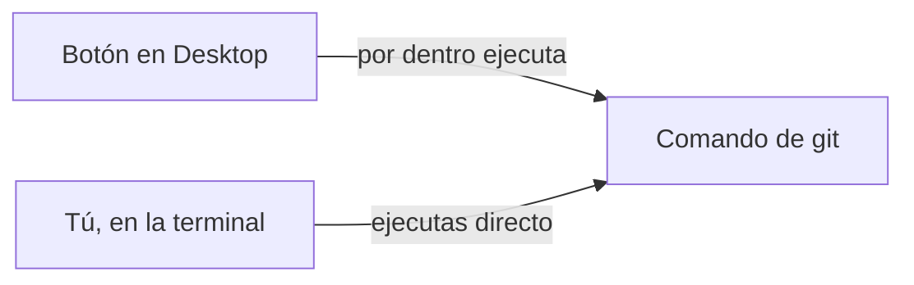
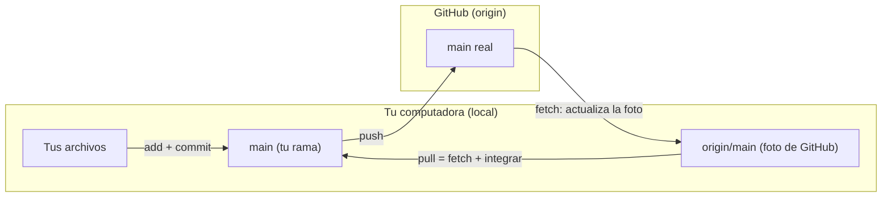
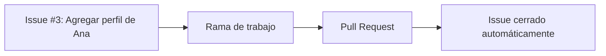
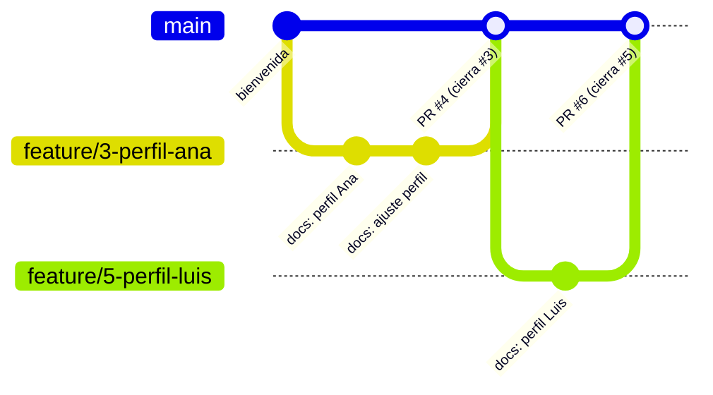
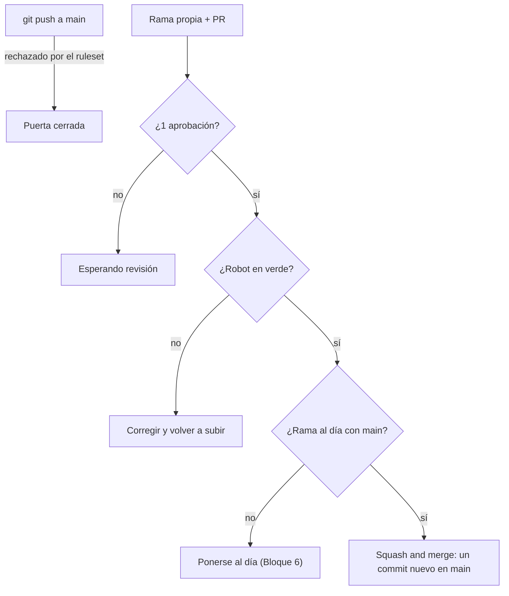
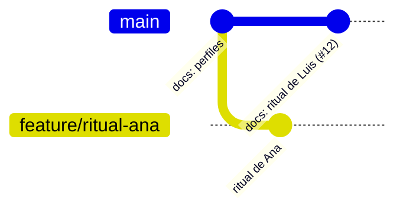
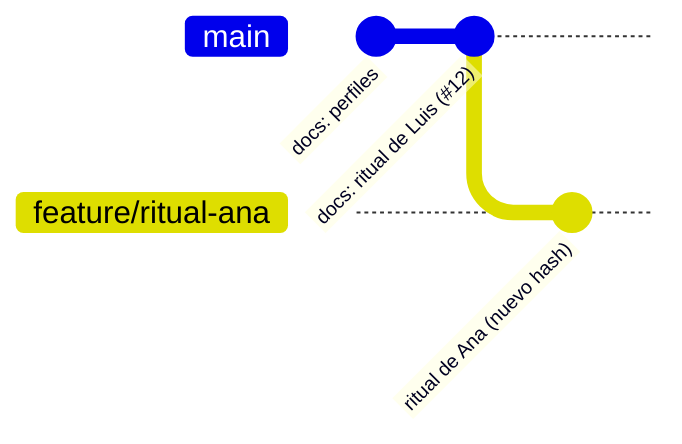
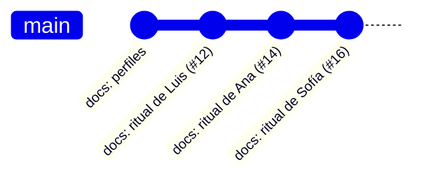
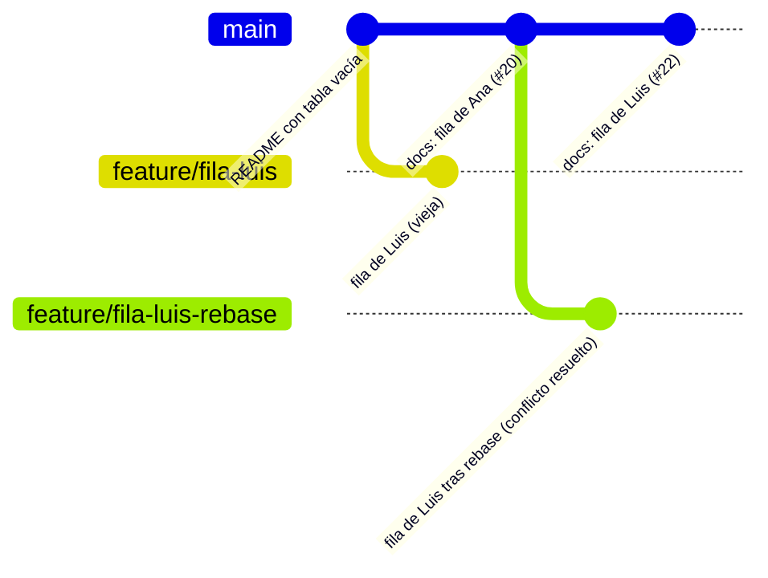
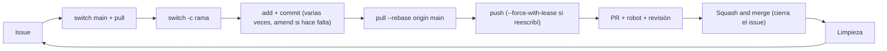

# Guion de clase: Git y GitHub en equipo, desde la terminal
## Sesión 2: 4 horas (intensiva)

> Formato de la clase: **cero código en pantalla** y **cero botones de GitHub Desktop**. Todo lo que el alumno hace con Git (crear repos, ramas, commits, sincronizar) lo hace en la terminal con **git** y **gh** (GitHub CLI). Lo que es configuración o revisión (colaboradores, reglas del repositorio, issues, revisión de Pull Requests, checks) se hace donde es más práctico: en **GitHub.com**. Lo que el alumno *mira* lo mira en **VS Code** (Source Control, vista Graph nativa y GitLens). Lo que se escribe en los archivos es solo texto en Markdown: nadie programa. La terminal no es el tema de la clase, es el volante: el tema es **trabajar de forma ordenada en un repositorio compartido**.

---

## 0. Filosofía del guion (léelo antes de dar la clase)

La lógica es la misma que en la Sesión 1: cada bloque abre una pregunta que **solo el siguiente bloque resuelve**. Repo local antes de repo compartido (primero se quita la interfaz, después se agregan personas); local vs. origin antes de cualquier rama de equipo (si no entienden que hay dos copias, nada de lo que sigue tiene sentido); issue antes de rama (el trabajo nace de una tarea, no de un impulso); flujo feliz antes de reglas (primero ven cómo *debería* ser, luego ven qué impide que alguien se lo salte); reglas antes de "el mundo siguió sin ti" (la regla de "rama al día" obliga a aprender `pull --rebase`); rebase limpio antes de rebase con conflicto; y al final, el ciclo completo **sin guía**.

Cinco decisiones de diseño que conviene tener presentes:

- **El botón solo ejecutaba un comando.** Es la idea que abre la clase y que se repite cada vez que aparece un comando nuevo: *"¿qué botón de Desktop era este?"*. No se enseña Git desde cero; se le quita el disfraz a lo que ya saben.
- **Terminal para Git, web para configurar.** Nadie pelea con la terminal para cosas que en GitHub.com son un formulario (agregar colaboradores, proteger ramas, activar el robot). La terminal se reserva para lo que pasa en su compu y en su historial.
- **Cada comando se verifica con los ojos.** Después de cada comando importante, el alumno mira dos lugares: la vista **Graph** de VS Code (qué pasó en local) y **GitHub.com** (qué pasó en origin). La frase que más se repite en la clase es *"¿dónde está esto: en tu compu, en origin o en los dos?"*.
- **Una idea nueva por bloque.** El `pull --rebase` se aprende primero sin conflicto (Bloque 6) y el conflicto se aprende después, sobre el mismo comando (Bloque 7). Nunca las dos cosas nuevas a la vez.
- **Historia limpia sin perder la pista.** El objetivo no es tener pocos commits, es que `main` se lea como una lista de decisiones: **un PR = un commit en `main`**, con un título que dice qué se hizo y un `(#N)` que lleva al PR, donde vive la conversación, la revisión y el issue que lo originó. Para lograrlo se combinan cuatro herramientas, cada una en su momento: commits pequeños mientras trabajas, `commit --amend` para corregir tu último commit antes de compartirlo, `pull --rebase` para ponerte al día sin nudos, y **squash merge** para integrar. La regla que las une: **solo se reescribe historia propia, y de preferencia antes de compartirla; la historia de `main` nunca se reescribe.** El Bloque 4 usa a propósito el merge por defecto de GitHub para que en el Bloque 6 puedan comparar el "antes" y el "después" en la misma Graph.

**Sobre los repositorios de la sesión:** cada alumno crea un repo con `git init` en el Bloque 1. Ese repo **se queda en local** para todos, excepto para los **líderes**: el repo del líder es el que se publica en GitHub y se convierte en el repo del equipo. Así, cada alumno termina con dos repos en su compu: uno sin `origin` (su práctica) y uno con `origin` (el clon del equipo), y ese contraste es la base del Bloque 2.

**Recomendación crítica:** verifica en los primeros 2 minutos que `gh auth status` responde bien en todas las máquinas. Quien no pase se va con un asistente; no se pausa al grupo.

### Mapa general (storyboard): ~240 minutos

| # | Bloque | Tema del temario | Duración | Herramienta protagonista |
|---|--------|-------------------|----------|--------------------------|
| - | Acto 0 | Preparación previa | (antes de clase) | - |
| 1 | Bloque 1 | El botón era un comando: `git init` y tu repo local | 20 min | Terminal integrada de VS Code + Graph |
| 2 | Bloque 2 | Local y origin: el líder publica, el equipo clona | 30 min | git + GitHub Web + Graph de VS Code |
| 3 | Bloque 3 | Tu primer issue: el trabajo nace de una tarea | 15 min | GitHub Web (Issues) + gh |
| 4 | Bloque 4 | El ritual diario: antes, durante y después + primer PR | 35 min | git + gh + GitHub Web (PR) |
| - | - | *Descanso* | 10 min | - |
| 5 | Bloque 5 | Las reglas de la casa: protección de ramas, squash e historia lineal + el robot revisor | 30 min | GitHub Web (Settings, Rulesets, Actions) |
| 6 | Bloque 6 | Historia limpia: `amend`, `pull --rebase` y squash | 35 min | git + Graph de VS Code + GitHub Web |
| 7 | Bloque 7 | Conflictos en equipo | 35 min | git + editor de merge de VS Code + GitLens |
| 8 | Bloque 8 | Ciclo completo sin red + limpieza | 15 min | Todo junto |
| - | - | Cierre: no hay una sola forma correcta + tarea | 15 min | - |

**Suma de control:** 20+30+15+35+10+30+35+35+15+15 = 240 min. No hay margen: si el grupo va atrasado, los primeros recortes recomendados son, en este orden: el Bloque 8 (la tarea para casa ya obliga a repetir el ciclo completo), la rama de práctica del paso 5 del Bloque 1, y la revisión cruzada del Bloque 4 (un solo revisor por PR, sin comentarios en línea). El Bloque 6 no se recorta: es donde se enseña a dejar la historia limpia. El cierre tampoco: es donde se deja claro que todo lo de hoy es una opción, no la regla.

---

## Acto 0: Preparación previa (antes de la clase)

**Del alumno (se pide con al menos una semana de anticipación):**

1. Lo que ya tienen de la Sesión 1: cuenta de GitHub, Git instalado y GitHub Desktop con la cuenta vinculada. **No hay que configurar Git a mano:** al vincular la cuenta, GitHub Desktop ya dejó registrado su nombre y correo, y esa misma configuración es la que usará la terminal.
2. **GitHub CLI** instalado (`gh --version` responde) y **autenticado** (`gh auth login` → GitHub.com → HTTPS → "Login with a web browser"). Si el alumno hizo el Reto 5 del autoestudio, ya tiene ventaja.
3. VS Code con **GitLens** instalado, **sin iniciar sesión ni conectar nada**. Si GitLens muestra su página de bienvenida o invita a crear una cuenta, iniciar una prueba de Pro o conectar GitHub, se cierra y se ignora. La vista **Graph** que se usa en clase es la **nativa** del panel Source Control de VS Code, no la *Commit Graph* de GitLens. Si les quedó la extensión *Git Graph* de la Sesión 1, no estorba, pero en esta sesión se usa la vista nativa.
4. Equipos de **3 o 4 personas** con un **líder** designado. Pueden ser los mismos de la Sesión 1.

**Del instructor:**

1. Un repositorio de demostración propio para proyectar cada paso antes de que lo hagan los equipos.
2. El **material de la sesión** (carpeta [`material/`](../material/) de este repositorio, ver Anexo), con el enlace enviado por correo antes de la clase. Contiene la guía del alumno, la tarea y la carpeta `plantillas-y-robot/` con la plantilla de issue, la plantilla de PR y la receta del robot. Los líderes copian esos tres archivos cuando la clase lo indica; nadie los escribe.
3. Recordar a los líderes que su repo de equipo debe ser **público**: la protección de ramas es gratuita en repos públicos de cuentas personales; en repos privados requiere un plan de pago o una organización con GitHub Team.

---

### 🧩 Bloque 1: El botón era un comando (20 min)

**Objetivo:** perderle el miedo a la terminal demostrando que cada botón de GitHub Desktop era un comando, y crear desde cero, con `git init`, un repositorio local con commits y una rama.

**Gancho de apertura (2 min):** proyecta GitHub Desktop con el botón **Push origin** y pregunta: *"¿Qué creen que hace este botón cuando lo presionan?"*. Después ciérralo frente a ellos. *"Escribe `git push origin`. Siempre lo hizo. Hoy le quitamos el disfraz."*

**Guion:**

1. (3 min) **Reconocimiento.** Cada alumno crea una carpeta vacía `practica-terminal` en el Escritorio con el Explorador de archivos (o Finder), la abre en VS Code (`File → Open Folder`) y abre la terminal integrada (`` Ctrl+` ``): la terminal ya está parada dentro de la carpeta. Primeros comandos, uno por uno, comentando qué responde cada uno: `git --version`, `gh auth status` y `git config user.name`. Este último responde con su nombre: *"eso lo dejó configurado GitHub Desktop cuando vincularon su cuenta. Desktop y la terminal usan el mismo Git."* Frase clave: *"La terminal no es más difícil, es más honesta: les dice exactamente lo que pasó."*
2. (3 min) **Nace el repo.** `git init`. Activar los archivos ocultos (como en la Sesión 1) y señalar que apareció la carpeta `.git`. Frase clave: *"Esto es exactamente lo que hacía `File → New Repository` en Desktop. Un comando, y la carpeta ya está vigilada."* Si la terminal menciona que la rama se llama `master`, no pasa nada: en el Bloque 2 verán cómo GitHub propone llamarla `main`.
3. (6 min) **El ciclo del commit, en texto.** En VS Code crean `notas.md` con un par de líneas en Markdown (qué esperan de esta sesión). Luego, leyendo en voz alta lo que responde cada comando:
   - `git status`: el archivo aparece en rojo, como *untracked*. *"Es el panel Changes de Desktop."*
   - `git add notas.md` y otra vez `git status`: ahora en verde. *"Es marcar la casilla."*
   - `git commit -m "Agrego mis notas"`. *"Es Summary + Commit."*
   - `git log --oneline`. *"Es la pestaña History."*
   - Un segundo cambio a `notas.md`, `git diff` para ver en verde y rojo qué cambió, y un segundo commit.
4. (2 min) Tabla de traducción proyectada (queda visible el resto del bloque):

| En GitHub Desktop | En la terminal |
|---|---|
| File → New Repository | `git init` |
| Clone repository | `gh repo clone usuario/repo` |
| Panel Changes | `git status` y `git diff` |
| Marcar la casilla del archivo | `git add archivo` |
| Summary + Commit to... | `git commit -m "mensaje"` |
| Pestaña History | `git log --oneline --graph` |
| Current Branch → New Branch | `git switch -c nombre-de-rama` |
| Cambiar de rama en Current Branch | `git switch nombre-de-rama` |
| Branch → Merge into Current Branch | `git merge nombre-de-rama` |
| Publish repository | `git remote add origin ...` + `git push -u origin main` |
| Push origin | `git push` |
| Fetch origin | `git fetch` |
| Pull origin | `git pull` |
| Create Pull Request | `gh pr create` |

5. (4 min) **Repaso de la Sesión 1, sin botones.** `git switch -c prueba`, un cambio a `notas.md`, commit, `git switch main` (o `master`): el cambio desaparece del archivo; `git switch prueba`: reaparece. Abrir la vista **Graph** del panel Source Control de VS Code y ver la bifurcación, igual que la vieron en la Sesión 1.

Frase de cierre: *"Este repo es solo suyo. No tiene nube, no tiene a nadie más. Y así se va a quedar: es su cuaderno de práctica."*

**Diagrama:**

**Transición:** *"Su repo vive solo en su compu. Para trabajar en equipo necesitamos que alguien lo suba y que los demás lo reciban. Y en cuanto eso pasa, aparece algo que Desktop les escondía: hay dos copias del repo. ¿Cuál es la de verdad?"*

---

### 🧩 Bloque 2: Local y origin, el líder publica y el equipo clona (30 min)

**Objetivo:** convertir el repo local del líder en el repo del equipo siguiendo las instrucciones estándar que da GitHub, y entender, viéndolo, que existen el repo **local** y el repo **origin**, y que la foto que tu compu tiene de origin solo se actualiza cuando tú la pides.

**Guion:**

1. (5 min) **Solo el líder, en su repo del Bloque 1:**
   - Reemplaza el contenido de `README.md` (o lo crea) con la base del equipo: un título `# Equipo [nombre]`, una tabla **Integrantes** con **solo el encabezado** (columnas: Nombre, Carrera, Usuario de GitHub) y una sección "Formato del perfil" con los campos que cada quien llenará en su archivo (nombre, carrera, una frase, foto).
   - Copia del material del curso las **dos plantillas** (issue y PR), con la misma ruta: `.github/ISSUE_TEMPLATE/tarea.md` y `.github/pull_request_template.md`. Se crean en VS Code y se pega el contenido con el botón *Copy raw file* de GitHub. *"Son dos preguntas cada una. No son reglas, son para no escribir a ciegas."*
   - `git add .` y `git commit -m "docs: base del equipo"`. Mencionar que `git add .` agrega todo lo que cambió en la carpeta, y por eso antes conviene revisar `git status`.

   El resto del equipo observa la pantalla del líder.
2. (7 min) **Solo el líder, en GitHub.com:** `New repository` → nombre `equipo-[nombre]` → **Public** → **sin** README, **sin** .gitignore y **sin** licencia. Advertencia en voz alta: *"el repo en GitHub tiene que nacer vacío, porque la historia ya existe en su compu."* Al crearlo, GitHub muestra una página de instrucciones; el líder usa la sección **"…or push an existing repository from the command line"** y copia los comandos a su terminal. Leerlos uno por uno antes de ejecutarlos:
   - `git remote add origin https://github.com/lider/equipo-[nombre].git`: *"le presento a mi repo la dirección de su casa en internet, con el apodo origin."*
   - `git branch -M main`: *"le pongo a mi rama principal el nombre que GitHub espera."*
   - `git push -u origin main`: *"subo main y dejo amarrada mi rama con la de origin."*

   Refrescar GitHub.com: aparecen el README **y** los commits del Bloque 1. Frase clave: *"No subió solo los archivos, subió la historia completa. Y fíjense qué no subió: la rama `prueba`. Solo sube lo que tú le dices."*
3. (5 min) **Solo el líder, en GitHub.com:** `Settings → Collaborators → Add people` con cada compañero (ya lo conocen de la Sesión 1). Los compañeros aceptan la invitación en cuanto llegue, desde el correo o desde `github.com/notifications`.
4. (4 min) **El resto del equipo:** en la terminal, salir de su carpeta de práctica hacia el Escritorio (`cd ..`) y clonar: `gh repo clone lider/equipo-[nombre]`. Abrir la carpeta nueva en VS Code (`File → Open Folder`). Frase clave: *"Clonar es el único momento en el que no hacen `git init`: el repo ya existe, solo se lo traen."*
5. (4 min) **Dos repos, dos realidades.** Todos, en su repo de equipo: `git remote -v`, que muestra la dirección de origin. Luego, quien no es líder vuelve un momento a su `practica-terminal` y corre lo mismo: **no responde nada**. *"Ese repo no tiene casa en internet, y está bien. origin no es una palabra mágica: es solo el apodo de una dirección, y un repo puede no tener ninguna."* De regreso en el repo del equipo: `git branch -a` muestra `main` y `remotes/origin/main`. Explicación central del bloque: **`main` es tu rama; `origin/main` es la foto que tu compu tiene de la rama `main` que vive en GitHub.** Son dos cosas distintas que a veces coinciden. Señalar las dos etiquetas sobre el mismo commit en la **Graph** de VS Code.
6. (5 min) **La foto vieja.** El líder agrega una línea de bienvenida al `README.md`, `git add README.md`, `git commit -m "docs: bienvenida al equipo"`, `git push`. El resto corre `git status` y lee: *"Your branch is up to date with 'origin/main'"*. Pregunta al grupo: *"¿Es verdad?"*. **No lo es:** su foto de origin es vieja. Ahora `git fetch` y otra vez `git status`: *"Your branch is behind 'origin/main' by 1 commit"*. En la Graph, `origin/main` ya está un commit adelante de `main`. Por último `git pull`, y las dos etiquetas vuelven a juntarse.

   Frase clave: *"`git status` no le pregunta a GitHub, le pregunta a tu foto de GitHub. `fetch` actualiza la foto; `pull` actualiza la foto y además trae los cambios a tu carpeta."*

**Diagrama:**

> El líder puede hacer push directo a `main` en este momento porque todavía no hay reglas. Es a propósito: en el Bloque 5 esa puerta se cierra.

**Transición:** *"Ya tienen un repo compartido y saben quién tiene la versión más nueva. Ahora, antes de que alguien toque un archivo: ¿quién decide qué hay que hacer y quién lo hace?"*

---

### 🧩 Bloque 3: Tu primer issue (15 min)

**Objetivo:** entender el issue como la unidad de trabajo del equipo y crear el primero.

**Guion:**

1. (3 min) Analogía: un issue es una **comanda** en una cocina. Nadie cocina un platillo que no tenga comanda; nadie trabaja algo que no tenga issue. Tiene título, descripción, responsable y un número (`#1`, `#2`...) con el que se le puede nombrar en cualquier lugar del repo.
2. (5 min) Cada integrante crea su propio issue **en GitHub.com**: pestaña **Issues → New issue** → elegir la plantilla **Tarea** (la que copió el líder) → título `Agregar perfil de [tu nombre]` → responder en una línea las dos preguntas de la plantilla (*¿qué hay que hacer?* y *¿cuándo está terminado?*) → en el panel derecho, **Assignees → assign yourself** → **Create**. Señalar el número que le tocó.
3. (4 min) Ahora la misma lista desde la terminal: `gh issue list`. *"La web y la terminal le preguntan lo mismo a GitHub."* Cada quien anota **el número** de su issue; lo necesita en el siguiente bloque. Para quien quiera, el equivalente en terminal de lo que acaban de hacer es `gh issue create`; en adelante, cada quien crea sus issues donde le resulte más cómodo.
4. (3 min) Dos ideas para cerrar:
   - El líder (o cualquiera) puede crear issues para otros y asignarlos: así se reparte el trabajo en un equipo real.
   - **La plantilla es configuración, y la configuración es un archivo.** El menú que les ofreció "Tarea" existe porque hay un archivo en `.github/ISSUE_TEMPLATE/`. Abrir `tarea.md` en VS Code y señalar solo las líneas de arriba, entre los `---`: `name` es el nombre que vieron en el menú y `about` es la descripción. *"Si agregan otro archivo en esa carpeta, aparece otra opción en el menú. Así se configura buena parte de GitHub: con archivos dentro de `.github`, que viajan con el repo y entran por PR como cualquier otro cambio."* No se experimenta en clase; queda como invitación para la tarea.

**Diagrama:**

**Transición:** *"Ya todos tienen una tarea con número. Ahora viene lo más importante del día: el ritual que van a repetir cada vez que se sienten a trabajar en un equipo."*

---

### 🧩 Bloque 4: El ritual diario, antes, durante y después + primer PR (35 min)

**Objetivo:** ejecutar de principio a fin el ciclo de trabajo en una rama propia, desde la tarea hasta el merge, y convertirlo en hábito. En este bloque cada quien trabaja en **su propio archivo**, así que nadie choca con nadie: es el flujo feliz.

**Guion:**

1. (3 min) Presentar el ritual en tres momentos, que se proyecta y queda visible todo el bloque:
   - **Antes de empezar:** ponerse al día.
   - **Durante:** commits pequeños y mirar seguido dónde estás.
   - **Después:** subir, pedir revisión, integrar y limpiar.

2. (5 min) **Antes de empezar.** Todos, en su repo de equipo, en este orden:
   - `git switch main`: *"me paro en la base."*
   - `git pull`: *"me pongo al día con origin."*
   - `git switch -c feature/[número]-perfil-[tu-nombre]` (ejemplo: `feature/3-perfil-ana`): *"abro mi desvío desde un main fresco."* El número del issue en el nombre de la rama ata el trabajo con su tarea.
   - Mirar la barra inferior de VS Code y la Graph: la rama nueva nace exactamente sobre `main`.

   Frase clave: *"Nunca se trabaja en main. Main es la mesa donde se sirve, no la tabla donde se corta."*

3. (8 min) **Durante.** Cada quien crea en VS Code una carpeta `integrantes` y dentro su archivo `[tu-nombre].md`, siguiendo el formato que dejó el líder en el README. Mientras lo escriben:
   - `git status`, `git add integrantes/[tu-nombre].md` y `git commit -m "docs: agrego perfil de [tu nombre]"`. Explicar el prefijo del mensaje como convención de equipo: `docs:` para documentos, `fix:` para correcciones, `feat:` para algo nuevo. Así el historial se lee solo.
   - Un segundo cambio pequeño al mismo archivo, `git diff` antes del `add`, y segundo commit.
   - `git log --oneline --graph`: sus dos commits encima de `main`.
   - Frase clave: *"En tu rama, commits pequeños y seguidos: son tus puntos de guardado. Nadie te va a juzgar por tener muchos; más adelante vamos a ver cómo se convierten en uno solo al llegar a main."*
   - Señalar el panel Source Control de VS Code: muestra lo mismo que `git status`, pero no lo usamos para hacer commit; lo usamos para **mirar**.

4. (4 min) **Después, parte 1: subir y pedir revisión.**
   - `git push -u origin feature/3-perfil-ana`. Explicar el `-u` (el mismo que usó el líder en el Bloque 2): *"le presento mi rama a origin; a partir de aquí basta con `git push`."* En la Graph aparece `origin/feature/3-perfil-ana`.
   - `gh pr create --web`: la terminal abre el formulario del PR en el navegador, ya con su rama elegida y la **plantilla de PR** en la descripción. Llenar las dos partes:
     - el **título**, con la misma convención que los commits (`docs: agrego perfil de Ana`), porque más adelante ese título es lo que quedará escrito en la historia de `main`;
     - la descripción: una línea en *¿Qué cambia?* y el número del issue junto a `Closes #` (`Closes #3`). Es una instrucción para GitHub: cuando este PR se integre, el issue #3 se cierra solo.
   - **Create pull request**.
   - Cuando ya se sabe qué poner, todo cabe en un solo comando sin abrir el navegador: `gh pr create --base main --title "docs: agrego perfil de Ana" --body "Closes #3"`. Se usa en los siguientes bloques, pero cualquiera de las dos formas es válida.

5. (8 min) **Revisión en GitHub.com**, en rotación: cada quien revisa el PR del compañero de su derecha.
   - Pestaña **Files changed**: el mismo verde/rojo de siempre.
   - Dejar un comentario en una línea (el `+` azul que aparece al pasar el mouse).
   - **Review changes → Approve → Submit review**.

6. (5 min) **Después, parte 2: integrar y limpiar.** El **autor** de cada PR, ya aprobado, presiona **Merge pull request → Confirm merge** (merge commit, la opción por defecto) y luego **Delete branch**. Ir a la pestaña Issues: su issue se cerró solo. De vuelta en la terminal:
   - `git switch main` y `git pull`: su perfil y los de los compañeros aparecen en la carpeta.
   - `git branch -d feature/3-perfil-ana`: borra la rama local, ya no sirve.
   - `git fetch --prune`: borra la foto de la rama remota que ya no existe en GitHub.
   - Graph: todas las ramas se reencontraron en `main`.
   - `git log --oneline --graph` en `main`, y leerlo en voz alta: aparecen sus commits de trabajo (*"docs: ajuste perfil"*) mezclados con líneas *"Merge pull request #4 from lider/feature/3-perfil-ana"*, y la Graph dibuja un nudo por cada PR. Solo observar, sin juzgar todavía: *"tómenle foto mental a esto; en el Bloque 6 lo vamos a comparar."*

   Frase clave: *"Una rama es un desvío temporal. Si una rama vive más de un par de días, algo está mal."*

7. (2 min) **GitLens, el que responde "¿quién escribió esto?".** Abrir el `README.md` y poner el cursor en una línea que haya escrito el líder:
   - Al final de la línea aparece en gris el autor, hace cuánto y el mensaje del commit (**Current Line Blame**).
   - Pasar el mouse encima abre la tarjeta del commit (**hover**) con autor, fecha, mensaje completo y lo que cambió.
   - Arriba del archivo, la línea pequeña con el último cambio y la lista de autores (**CodeLens**).

   Frase clave: *"GitLens solo mira. No sube nada ni cambia nada, y no necesita cuenta. Las acciones las seguimos haciendo en la terminal."* Advertir que la tarjeta y el menú del commit también ofrecen botones como *Explain*, *Connect to GitHub*, *Open in Commit Graph*, *Revert*, *Reset* o *Rebase*: hoy **no se usan**. Los primeros piden cuenta; los de acción los hacemos con comandos, para saber exactamente qué pasó.

**Diagrama:**

**Transición:** *"Todos siguieron el ritual porque se los pedí. Pero en un equipo real alguien va a tener prisa y va a hacer push directo a main, sin issue, sin PR, sin revisión. Y aunque todos lo sigan, ya vieron cómo quedó la historia de main con solo cuatro PRs: imagínenla con cuatrocientos. ¿Qué impide el atajo, y qué mantiene la historia legible?"*

**→ Descanso: 10 min**

---

### 🧩 Bloque 5: Las reglas de la casa (30 min)

**Objetivo:** configurar el repositorio desde la web para que el ritual deje de ser una sugerencia y se vuelva obligatorio, y entender (sin programar nada) que un robot puede revisar cada PR.

**Guion:**

1. (3 min) **La puerta abierta.** El líder demuestra el problema en su terminal: edita el `README.md` en `main`, `git commit -am "docs: cambio directo"`, `git push`. Funciona. *"Nadie revisó esto. Nadie sabe por qué se hizo. Así se rompen los proyectos."*
2. (8 min) **Cerrar la puerta y decidir cómo entra el trabajo.** El líder, en GitHub.com (el resto del equipo mira su pantalla):
   - `Settings → General`, en la sección *Pull Requests*:
     - **Desmarcar** *Allow merge commits* y *Allow rebase merging*; dejar marcado solo **Allow squash merging**. En su lista *Default commit message* elegir **Pull request title and description**.
     - Activar **Automatically delete head branches**. *"Al mergear, GitHub borra la rama remota solo; ya no hay que acordarse del botón."*

     Explicación breve (la práctica llega en el Bloque 6): *"Squash significa aplastar. A partir de ahora, todos los commits de una rama, por muchos que sean, entran a main como **un solo commit**, con el título del PR y un `(#número)` que lleva directo al PR. Los nudos que vieron en el Bloque 4 dejan de existir."*
   - `Settings → Rules → Rulesets → New ruleset → New branch ruleset`:
     - **Ruleset name:** `proteger-main`. **Enforcement status:** Active.
     - **Target branches:** Add target → *Include default branch*.
     - Dejar marcadas **Restrict deletions** y **Block force pushes**.
     - Marcar **Require linear history**.
     - Marcar **Require a pull request before merging** → *Required approvals*: **1**.
     - **Create**.

   Leer cada regla en voz alta y traducirla a lenguaje de equipo: "nadie borra main", "nadie reescribe main", "main es una línea recta, sin nudos", "todo entra por PR con al menos un visto bueno".
3. (4 min) **Ni el dueño.** El líder repite el truco del paso 1: commit directo en `main` y `git push`. Ahora la terminal responde con un rechazo (*"Repository rule violations"*, *"Changes must be made through a pull request"*). Frase clave: *"El líder es el administrador del repo y aun así no pudo. La regla no es para desconfiar de alguien, es para que nadie tenga que acordarse."*

   Para limpiar su `main` local, que ahora tiene un commit que origin nunca va a aceptar: `git reset --hard origin/main`. Traducción: *"haz que mi main sea exactamente igual a la foto de origin."* Advertencia en voz alta: este comando **tira** los cambios locales que no estén en origin; solo se usa cuando uno está seguro de que no los quiere.
4. (7 min) **Contratar al robot.** El líder, en GitHub.com, pestaña **Actions → set up a workflow yourself**. GitHub propone un archivo dentro de `.github/workflows/`; el líder le pone de nombre `revision.yml`, borra el contenido de ejemplo y **pega la receta** del material del curso (`material/plantillas-y-robot/.github/workflows/revision.yml`, con *Copy raw file*). Explicación sin código: *"Esto es una receta. Cada vez que alguien abra un PR, GitHub va a prestar una computadora por unos segundos, va a seguir la receta y va a reportar el resultado en el PR. Esta receta revisa que nadie deje marcadores de conflicto olvidados. En equipos reales, la receta corre pruebas, revisa ortografía o publica la página."*

   Al guardar (**Commit changes**), GitHub ya no deja escribir directo en `main`: elegir **Create a new branch for this commit and start a pull request**. Ese mismo PR es la primera prueba del robot: en la parte de abajo aparece el check **Sin marcadores de conflicto** corriendo y luego en verde. Un compañero lo aprueba y el líder lo integra; el botón verde ahora dice **Squash and merge**, la única opción que dejaron. *"Hasta el robot tuvo que entrar por PR."* Desde la terminal también se puede consultar: `gh run list`.
5. (5 min) **Hacer obligatorio al robot.** El líder vuelve al ruleset `proteger-main` → marca **Require status checks to pass** → **Add checks** → busca y agrega **Sin marcadores de conflicto** (ya aparece porque corrió una vez) → marca **Require branches to be up to date before merging** → **Save changes**. Traducir: "el robot tiene que dar el visto bueno" y "tu rama tiene que estar al día con main". En la terminal, todos: `git switch main` y `git pull` para traerse la receta.
6. (3 min) **Demostración en rojo** (solo el instructor, en su repo de demostración): abrir un PR con un archivo que contiene una línea `<<<<<<<` olvidada. En el PR aparece la **X roja** del robot y el botón de merge bloqueado. Corregir el archivo, commit y push: la X se vuelve palomita verde y el botón se desbloquea. En la terminal: `gh pr checks`.

**Diagrama:**

**Transición:** *"La última regla dice que tu rama tiene que estar al día con main. Pero mientras tú trabajas, tus compañeros siguen mergeando cosas. Tu rama nace fresca y envejece sola. ¿Cómo la pongo al día sin ensuciar la historia?"*

---

### 🧩 Bloque 6: Historia limpia, `amend`, `pull --rebase` y squash (35 min)

**Objetivo:** aprender a dejar la historia limpia sin perder la pista de nada: corregir el último commit antes de compartirlo (`amend`), poner al día una rama propia sin nudos (`pull --rebase` + `--force-with-lease`) e integrarla a `main` como un solo commit que apunta a su PR (squash). En este bloque **no hay conflictos**: cada quien sigue tocando solo su archivo.

**Guion:**

1. (4 min) Nueva tarea para todos, con todo el ritual: issue `Agregar mi ritual de trabajo a mi perfil` (en la web o con `gh issue create`), luego `git switch main` y `git pull`. Detenerse en lo que responde el pull: **Fast-forward**. *"Como nadie trabaja directo en main, main solo avanza hacia adelante, y su pull siempre es un avance directo: nunca debería crear un commit nuevo en su main."* Después `git switch -c feature/[número]-ritual-[tu-nombre]`. Cada quien agrega a **su** perfil una sección "Mi ritual de trabajo" con los tres momentos, escritos en sus palabras, y hace commit.
2. (5 min) **El commit con un olvido: `amend`.** Pedirles que, a propósito, encuentren algo que les faltó (un error de dedo, una línea más). La tentación es hacer otro commit llamado *"ya ahora sí"*. En su lugar:
   - corregir el archivo, `git add` y `git commit --amend --no-edit`: *"mete este cambio al último commit, sin tocar su mensaje."*
   - `git log --oneline`: sigue habiendo **un** commit, pero su hash cambió. *"No lo editaste: lo reemplazaste por uno nuevo."*
   - Si lo que estaba mal era el mensaje: `git commit --amend -m "docs: agrego mi ritual de trabajo"`.

   Frase clave: *"Amend es gratis mientras el commit no haya salido de tu compu. Antes de hacer push, corrige todo lo que quieras."* Después: `git push -u origin ...` y `gh pr create --base main --title "docs: agrego mi ritual de trabajo" --body "Closes #[número]"`.
3. (4 min) El primer PR que consiga aprobación se integra. Todos los demás ven en su PR el aviso **"This branch is out-of-date with the base branch"** y el merge bloqueado. GitHub ofrece un botón **Update branch**: *"no lo usen. Por defecto ese botón mete un commit de merge dentro de su rama: justo el nudo que queremos evitar. Lo vamos a hacer desde la terminal, y limpio."*
4. (3 min) **La analogía.** Tu rama es un post-it pegado sobre una versión vieja del documento. Hay dos formas de ponerla al día:
   - **merge:** pegas encima otro post-it que dice "y aquí junté lo nuevo". Funciona, pero la historia se llena de nudos.
   - **rebase:** despegas tu post-it, cambias la hoja de abajo por la versión más nueva y vuelves a pegar tu post-it encima. La historia queda como una línea recta, *como si hubieras empezado a trabajar hoy*.
5. (6 min) **Ejecutarlo.** Parados en su rama:
   - `git pull --rebase origin main`: *"trae lo nuevo de main de origin y vuelve a pegar mis commits encima."*
   - Graph de VS Code: su commit ahora está encima del último commit de main, en línea recta.
   - `git push` → **rechazado**. Pregunta al grupo: *"¿por qué, si no hice nada malo?"*. Porque el rebase creó commits nuevos (con otro hash) y origin todavía tiene los viejos: para origin, la historia no coincide. (Pasa exactamente lo mismo si hacen `amend` de un commit que ya habían subido.)
   - `git push --force-with-lease`. Traducción: *"empuja a la fuerza, pero solo si nadie más tocó mi rama desde la última vez que la vi."* Es la versión con cinturón de seguridad del `--force` a secas.
   - En el PR: el aviso de rama vieja desapareció, el robot vuelve a correr y el merge se desbloquea.
6. (7 min) **Squash: un PR, un commit.** Cuando el PR tenga aprobación, el autor presiona **Squash and merge**. Antes de confirmar, **leer en voz alta** la caja que aparece: el título es el del PR con un `(#número)` al final, y la descripción trae el `Closes #[número]`. *"Esto es lo que va a quedar escrito en main para siempre. Por eso el título del PR importa."* Confirmar. Luego, en la terminal:
   - `git switch main`, `git pull` y `git log --oneline --graph`. **Comparar con la foto mental del Bloque 4:** arriba, una línea recta, un commit por PR, cada uno con su `(#número)`; abajo, los nudos y los *"Merge pull request..."* de antes de las reglas.
   - **La pista no se perdió:** abrir su perfil y pasar el mouse sobre la sección nueva: el hover de **GitLens** muestra el commit del squash con su `(#número)` en el mensaje. En esa misma tarjeta, **Open Commit on GitHub** (solo abre el navegador, no pide conectar nada) lleva a la página del commit, y ahí GitHub enlaza el PR. Desde la terminal, lo mismo: `gh pr view [número] --web`. En el PR siguen vivos todos los commits pequeños, los comentarios de la revisión y el issue que lo originó. *"Main cuenta el qué. El PR cuenta el cómo. El issue cuenta el porqué."*
   - **Limpieza después de un squash:** `git branch -d feature/...` ahora **falla** con *"not fully merged"*. No es un error: sus commits se aplastaron en uno nuevo con otro hash, y Git no los reconoce dentro de main. Confirmar que el PR dice **Merged** (en la web o con `gh pr view feature/...`) y borrar con `git branch -D feature/...`. *"`-D` mayúscula significa: ya verifiqué, bórrala de todas formas."*
7. (6 min) **Reglas de oro y el mapa de decisiones**, en voz alta y proyectados:
   - Solo se reescribe historia **propia**: `amend`, `rebase` y `--force-with-lease` únicamente en su rama y mientras nadie más trabaje en ella. La historia de `main` **nunca** se reescribe (y el ruleset lo impide).
   - Nunca `--force` a secas; siempre `--force-with-lease`.
   - Una rama, un PR. Después del squash la rama muere; lo siguiente nace de un `main` fresco.
   - Si algo sale raro a media operación: `git rebase --abort` y todo vuelve a como estaba antes de empezar.

   | Situación | Herramienta | ¿Reescribe historia? |
   |---|---|---|
   | Quiero guardar un avance en mi rama | Commit pequeño | No |
   | Me equivoqué en el último commit y **no** lo he subido | `git commit --amend` | Sí, solo mi último commit, en mi compu |
   | main avanzó mientras yo trabajaba | `git pull --rebase origin main` | Sí, solo mi rama |
   | Subir una rama que reescribí (rebase o amend) | `git push --force-with-lease` | Sí, solo mi rama en origin |
   | Integrar mi trabajo a main | **Squash and merge** en el PR | No: agrega un solo commit a main |
   | Traer main a mi compu | `git pull` estando en main | No: siempre es fast-forward |
   | Deshacer algo que ya está en main | `git revert` en una rama nueva + PR (el Revert de la Sesión 1) | No: agrega un commit que lo anula |

   Ya que lo entendieron, volverlo costumbre: `git config --global pull.rebase true`. A partir de aquí, cada `git pull` hace rebase en vez de merge. Es el único ajuste de configuración de la sesión, y se hace hasta que saben qué significa.

**Diagrama (antes del rebase):**

**Diagrama (después de `git pull --rebase origin main`):**

**Diagrama (main después del squash: un PR, un commit):**

**Transición:** *"Hoy el rebase fue limpio porque cada quien tocó su propio archivo. En la vida real dos personas tocan el mismo archivo, en la misma línea, el mismo día. ¿Qué hace Git cuando no sabe cuál de las dos versiones es la buena?"*

---

### 🧩 Bloque 7: Conflictos en equipo (35 min)

**Objetivo:** provocar a propósito un conflicto real durante un `pull --rebase`, resolverlo en el editor de merge de VS Code y terminar el rebase desde la terminal, sin pánico.

**Guion:**

1. (6 min) Tarea que **garantiza** el choque: cada integrante debe agregar **su fila** a la tabla *Integrantes* del `README.md`, justo debajo del encabezado que dejó el líder en el Bloque 2. Ritual completo: issue, `git switch main`, `git pull`, rama `feature/[número]-fila-[tu-nombre]`, agregar la fila, commit, push, PR con `Closes #[número]`.
2. (3 min) Se integra con **Squash and merge** el primer PR aprobado. Todos los demás quedan desactualizados, como en el Bloque 6. Pero esta vez GitHub dice algo nuevo en el PR: **"This branch has conflicts that must be resolved"**.
3. (4 min) Todos, en su rama: `git pull --rebase origin main`. La terminal responde **CONFLICT** y se detiene a mitad del camino. `git status` explica exactamente dónde están parados: en medio de un rebase, con un archivo en conflicto, y les sugiere los comandos para seguir (`--continue`) o salir (`--abort`). Frase clave: *"Git no se rompió. Se detuvo a preguntarte algo que no puede decidir solo."*
4. (12 min) **Resolver en VS Code.** El `README.md` aparece marcado en el panel Source Control. Al abrirlo se ven las marcas `<<<<<<<` / `=======` / `>>>>>>>` y los botones **Accept Current / Accept Incoming / Accept Both**, o el botón **Resolve in Merge Editor** para verlo en tres paneles.
   - Explicar las marcas como en la Sesión 1: dos borradores del mismo párrafo.
   - **Aviso importante para el instructor:** durante un **rebase** las etiquetas se sienten al revés. *Current* es lo que **ya está en main** (la fila del compañero); *Incoming* es **tu commit** que se está volviendo a pegar. En este ejercicio da igual porque la respuesta correcta es **Accept Both**: queremos las dos filas. Dilo en voz alta antes de que alguien elija "Current" pensando que es lo suyo y borre su propia fila.
   - Revisar que la tabla quede bien (sin marcadores, una fila por persona) y guardar.
5. (5 min) **Terminar el rebase desde la terminal:**
   - `git add README.md`: *"le aviso a Git que ya resolví este archivo."*
   - `git rebase --continue`: Git abre un editor con el mensaje del commit para confirmarlo. Según cómo se instaló Git, puede ser una pestaña de VS Code (se cierra la pestaña) o un editor dentro de la misma terminal (se escribe `:wq` y Enter). En ambos casos no hay que cambiar nada: solo cerrar.
   - `git push --force-with-lease`.
   - Graph de VS Code: aunque hubo conflicto, su rama sigue siendo **una línea recta** encima de main. El conflicto se resolvió *dentro* de su commit, no con un commit extra de "arreglo el merge".
   - En el PR: el aviso de conflicto desaparece y el robot corre. **Si alguien dejó un marcador olvidado, el robot se pone en rojo:** exactamente para eso lo contrataron. Se corrige, commit, push, y vuelve a verde.
   - Botón de pánico, recordado en voz alta: en cualquier momento antes del `--continue`, `git rebase --abort` los regresa a como estaban.
6. (5 min) Integrar en cadena el resto de los PRs con **Squash and merge**. El tercero y el cuarto probablemente vuelvan a chocar: que lo resuelva cada autor, ya sin ayuda del instructor. Al final, `git switch main`, `git pull`, limpieza (`git branch -D` de la rama ya integrada) y abrir el `README.md` con **GitLens**, esta vez con la anotación de todo el archivo: `Ctrl+Shift+P` → **GitLens: Toggle File Blame**. A la izquierda de cada línea aparece quién la escribió y en qué commit: cada fila de la tabla muestra a su autor y el `(#número)` de su PR. Se apaga con el mismo comando. *"Esta tabla la escribieron cuatro personas en paralelo, con conflictos de por medio, y la historia de main sigue siendo una línea recta donde cada línea de la tabla lleva a su PR."*

**Diagrama:**

*(La rama `feature/fila-luis-rebase` es la misma rama de Luis después del `pull --rebase`: sus commits se volvieron a pegar sobre el squash de Ana. Al integrarse, entra a main como un solo commit.)*

**Transición:** *"Ya hicieron todo con alguien guiándolos paso a paso. La pregunta real es: mañana, solos, frente a un repo de equipo, ¿saben qué hacer primero?"*

---

### 🧩 Bloque 8: Ciclo completo sin red + limpieza (15 min)

**Objetivo:** repetir el ciclo entero **sin instrucciones paso a paso**, usando solo el acordeón del ritual, y dejar el repo limpio.

**Guion:**

1. (2 min) Proyectar el acordeón (abajo) y apagar la pantalla del instructor. La consigna: *"Cada quien crea un issue para otra persona del equipo, y cada quien resuelve el issue que le asignaron. Solo con el acordeón."* Tema libre en Markdown: una recomendación (libro, video, canal) en un archivo `recomendaciones/[tu-nombre].md`.
2. (10 min) Ciclo completo: issue asignado a un compañero (en la web, o con `gh issue create --assignee usuario-del-compañero`), `gh issue list --assignee @me` para encontrar el propio, ritual de antes, trabajo, ritual de después, revisión, `amend` y `pull --rebase` si hacen falta, squash, limpieza. El instructor y los asistentes solo responden preguntas; no tocan teclados.
3. (3 min) **Limpieza final**, todos: `git switch main`, `git pull`, `git branch` (solo debe quedar `main`; si queda alguna rama con PR ya integrado, `git branch -D`), `git fetch --prune`, una mirada a la pestaña Issues (todo cerrado) y a la pestaña Pull requests (nada abierto), y la prueba final: `git log --oneline` en `main`. Cada línea desde el Bloque 5 debe ser *un PR* con título convencional y `(#número)`. Si alguien encuentra un *"ya ahora sí"* o un *"Merge branch..."* en esa zona, algo del ritual se saltó: buen tema para la plenaria.

**Acordeón del ritual diario (se proyecta y se entrega):**

| Momento | Qué hago | Dónde / comando |
|---|---|---|
| **Antes** | Ver qué me toca | GitHub.com → Issues, o `gh issue list --assignee @me` |
| | Pararme en la base | `git switch main` |
| | Ponerme al día (siempre fast-forward) | `git pull` |
| | Abrir mi desvío | `git switch -c feature/[número]-[descripción]` |
| **Durante** | Ver qué cambió | `git status` / `git diff` |
| | Guardar una foto pequeña | `git add [archivo]` + `git commit -m "tipo: mensaje"` |
| | Corregir mi último commit (antes de subirlo) | `git add [archivo]` + `git commit --amend --no-edit` |
| | Ver dónde estoy | `git log --oneline --graph` / Graph de VS Code |
| | Si main avanzó, ponerme al día | `git pull --rebase origin main` |
| **Después** | Subir mi rama | `git push -u origin [rama]` (la primera vez) / `git push` |
| | Subir después de un rebase o amend | `git push --force-with-lease` |
| | Pedir revisión (título = futuro commit en main) | `gh pr create --web` (con plantilla) o `gh pr create --base main --title "tipo: qué hice" --body "Closes #[número]"` |
| | Ver el robot | Checks del PR en GitHub.com, o `gh pr checks` |
| | Revisar a otros | GitHub.com → Files changed → Review changes |
| | Integrar | GitHub.com → **Squash and merge** |
| | Tras el squash: limpiar | `git switch main` + `git pull` + `git branch -D [rama]` (tras ver el PR en *Merged*) |
| **Pánico** | Salir de un rebase a medias | `git rebase --abort` |
| | Deshacer algo que ya está en main | `git revert [hash]` en una rama nueva + PR |
| | Dejar mi main igual a origin | `git reset --hard origin/main` (tira lo local) |

**Diagrama:**

---

## Cierre: no hay una sola forma correcta + tarea (15 min)

### 1. El recorrido (3 min)

Recorrer la **Graph** del repo de un equipo, de abajo hacia arriba, una frase por bloque: "esos primeros commits nacieron con `git init` en la compu del líder (Bloque 1), ahí se publicó (Bloque 2), esos nudos son los perfiles, antes de las reglas (Bloques 3 y 4), ahí entró el robot, ya como squash (Bloque 5), y de ahí para arriba todo es una línea recta: un PR por línea, aunque hubo rebase (Bloque 6) y conflictos (Bloque 7)". La Graph misma es el argumento: la mitad de abajo contra la mitad de arriba.

### 2. La advertencia final: lo de hoy no es *la* forma de trabajar (6 min)

Es el mensaje más importante de la sesión y conviene decirlo casi textual:

*"Todo lo que hicimos hoy (un issue por tarea, una rama por issue, un visto bueno obligatorio, un robot revisor, rebase para ponerse al día, squash para integrar) es **una** estrategia. La elegimos porque sirve para enseñar y porque funciona bien para un equipo chico que trabaja en paralelo sobre el mismo repo. **No es la definitiva ni la correcta.** Es una de muchas."*

Proyectar la tabla y preguntar en cada fila: *"¿esto cambiaría sus reglas?"*

| Factor | Lo empuja hacia menos reglas | Lo empuja hacia más reglas |
|---|---|---|
| **Tamaño del equipo** | 1 a 3 personas que se sientan juntas | Decenas de personas que no se conocen |
| **Tamaño y vida del proyecto** | Un prototipo de fin de semana | Un producto que vivirá años |
| **Tiempo disponible** | Un hackatón de 48 horas | Un semestre o un proyecto sin fecha de fin |
| **Burocracia que el equipo decide aceptar** | Confianza total, acuerdos de palabra | Aprobaciones, revisores designados, checklists |
| **Trazabilidad necesaria** | Nadie va a preguntar por qué se hizo algo | Hay que explicar cada cambio (cliente, auditoría, calificación) |
| **Costo de un error** | Si algo se rompe, se arregla en cinco minutos | Si algo se rompe, afecta a usuarios reales |
| **Frecuencia de entrega** | Se entrega una vez, al final | Se entrega todos los días |
| **Experiencia del equipo** | Todos dominan Git | Hay quien está empezando |

Tres ejemplos rápidos para aterrizarlo:

- **Proyecto personal:** trabajar directo en `main` es perfectamente válido. Nadie más necesita revisar.
- **Hackatón de 48 horas:** ramas cortas y merge sin aprobación obligatoria; el robot quizá sobra. La velocidad importa más que la historia perfecta.
- **Producto con usuarios:** además de todo lo de hoy, probablemente ramas por entorno, versiones con etiquetas, más de un revisor y robots que corren pruebas de verdad.

E incluso dentro de lo de hoy hay alternativas legítimas: rebase merging en vez de squash si cada commit de la rama vale por sí solo, merge commits si el equipo quiere ver exactamente cuándo se integró cada rama, o ninguna protección si el equipo es de dos personas que se hablan todo el día.

Cierre de la idea: *"Esto es lo mágico de usar Git directamente y no a través de una interfaz que decide por ustedes: **se pueden adaptar**. Pueden experimentar, poner sus propias reglas, cambiarlas cuando dejen de servir, e ignorarlas cuando tenga sentido, siempre que el equipo lo sepa y lo acuerde. Un botón les da una sola forma de hacer las cosas; la terminal les da todas. Las reglas están para servirle al equipo, no al revés."*

### 3. La tarea para casa (5 min)

Proyectar [`material/tarea.md`](../material/tarea.md), que es el mismo documento que se envía a los alumnos. Es la continuación directa de la advertencia anterior: ahora les toca a ellos decidir. Puntos que conviene decir en voz alta, porque son los que más se olvidan:

- **Qué:** elegir una idea de proyecto, investigar al menos tres estrategias de trabajo y dos formas de integrar, elegir la que encaja con su caso y justificarla en `docs/soporte/workflow_y_politicas_de_trabajo_colaborativo.md`.
- **Cómo:** el documento se escribe con el flujo de trabajo (issue, rama, PR revisado). El historial del repo cuenta como parte de la entrega.
- **Lo que casi nadie hace si no se pide:** documentar también las reglas que decidieron **no** tener, y ajustar la configuración del repo si eligieron algo distinto a lo de clase.
- **Video:** de 5 a 10 minutos, con diapositivas y con todos los integrantes. Debe explicar el documento, no leerlo.
- **Fecha y acreditación:** antes del siguiente sesión. **Sin el video no se acreditan los puntos de formación integral.**

### 4. Recursos y preguntas (1 min)

- Recursos para la tarea y para seguir practicando: la ayuda de GitHub CLI desde la terminal (`gh help` y `gh [comando] --help`), la documentación de GitHub sobre flujos de trabajo, rulesets y métodos de merge, Pro Git en español (capítulos de ramas y de trabajo con remotos), y Oh My Git! para practicar rebase de forma visual.
- Recordar que cada quien se lleva también su `practica-terminal`: un repo solo local, sin origin, donde pueden equivocarse sin consecuencias antes de probar algo en el repo del equipo.
- Mensaje de despedida: *"Lo que aprendieron hoy no es Git, es trabajo en equipo. Git solo es la herramienta que lo deja por escrito, y ahora las reglas las ponen ustedes."*
- Preguntas abiertas (si no alcanza el tiempo, se reciben como issues en este repositorio).

---

## Notas finales para el instructor

- El Bloque 2 es el que más se atrasa (invitaciones sin aceptar, autenticación de `gh` fallida, líderes que crean el repo en GitHub **con** README y luego no pueden hacer push). Si un líder marcó "Add a README", lo más rápido es borrar ese repo en `Settings → Danger Zone` y crearlo de nuevo vacío.
- Si al hacer el primer commit del Bloque 1 la terminal responde *"Please tell me who you are"*, ese alumno no tiene la configuración que deja GitHub Desktop (por ejemplo, porque usa otra computadora). Resuélvelo aparte con un asistente: `git config --global user.name` y `git config --global user.email` con el correo de su cuenta de GitHub.
- El Bloque 7 es el clímax: no lo recortes. Si el tiempo aprieta, recorta el Bloque 8: la tarea para casa obliga a repetir el ciclo completo sin guía.
- **GitLens, solo lo gratuito y sin cuenta.** En la clase se usan únicamente **Current Line Blame** (autor al final de la línea), los **hovers** (tarjeta del commit), **CodeLens** (autores arriba del archivo), **File Blame** (anotación de todo el archivo) y **Open Commit on GitHub** (solo abre el navegador). Quedan fuera: *Commit Graph* de GitLens (se usa la Graph nativa de VS Code), *Explain* (IA, requiere cuenta de GitKraken), *Connect to GitHub* y *Launchpad* (integraciones que requieren cuenta), y los botones de acción del menú del commit (*Revert*, *Reset*, *Rebase*, *Switch to Commit*...), que sí funcionan pero harían por nosotros lo que en esta sesión se hace con comandos. Si un alumno los descubre, la respuesta es la misma idea que abrió la clase: *"ese botón también es un comando; hoy lo escribimos nosotros."*
- **Etiquetas invertidas en rebase:** es el error más común de la sesión. Recuérdalo antes de que abran el editor de conflictos, no después.
- Si alguien se pierde por completo en su copia del equipo, la salida más rápida y segura es la de la Sesión 1: borrar la carpeta y volver a clonar con `gh repo clone`. Todo lo que ya estaba en origin sigue ahí. (Esto **no** aplica al repo del líder del Bloque 1 si todavía no hizo push: ese es el único lugar donde vive su historia.)
- **Por qué squash y no las otras dos opciones de GitHub:** *merge commit* agrega un nudo por PR (lo vieron en el Bloque 4); *rebase merging* deja la historia recta pero mete a main **todos** los commits pequeños de la rama, incluidos los *"ya ahora sí"*. Squash es la única que garantiza "un PR = un commit" sin exigirle al alumno que su rama esté impecable, y el detalle no se pierde porque vive en el PR. Si un alumno pregunta por rebase merging, la respuesta honesta es: sirve cuando cada commit de la rama vale la pena por sí solo, y eso exige una disciplina que se practica después.
- **Rama reutilizada después de un squash:** si alguien sigue trabajando en una rama que ya se integró y abre otro PR, sus commits viejos reaparecen y suelen chocar. La regla "una rama, un PR" evita esto; si pasa, lo más limpio es crear una rama nueva desde `main` y llevarse solo el cambio nuevo.
- Atajos que se pueden mencionar a quien vaya adelantado: `gh issue develop [número] --checkout` crea la rama ligada al issue y se cambia a ella en un solo paso; `gh pr merge --squash --delete-branch` integra el PR desde la terminal (una vez aprobado), borra la rama local y remota, y regresa a `main`.
- Temas que conscientemente **no** entran en esta sesión: `git rebase -i` (reordenar, unir o reescribir varios commits a mano; requiere manejar un editor de instrucciones), `git stash`, `cherry-pick`, `reflog`, tags y releases, y flujos con varias ramas de larga vida. Son el material natural de una sesión avanzada.

---

## Anexo para el instructor: material de la sesión

El material del alumno vive en la carpeta [`material/`](../material/) de este repositorio, y el enlace se envía por correo antes de la clase. Además de la [guía del alumno](../material/guia-alumno.md) y la [tarea](../material/tarea.md), incluye la carpeta [`plantillas-y-robot/`](../material/plantillas-y-robot/) con los tres archivos de configuración que copian los equipos. Ninguno de esos tres archivos se proyecta completo ni se explica línea por línea: en clase solo se ve su efecto.

| Archivo | Qué hace | Quién lo copia y cuándo |
|---|---|---|
| `.github/ISSUE_TEMPLATE/tarea.md` | Plantilla de issue con dos preguntas: *¿qué hay que hacer?* y *¿cuándo está terminado?* | El líder, en su repo local, en el Bloque 2 (antes del primer push) |
| `.github/pull_request_template.md` | Plantilla de PR: *¿qué cambia?* y `Closes #` | El líder, en su repo local, en el Bloque 2 (antes del primer push) |
| `.github/workflows/revision.yml` | El robot: en cada PR hacia `main` busca marcadores de conflicto (`<<<<<<<` o `>>>>>>>`) olvidados en archivos Markdown y falla si encuentra alguno. El nombre de su check, que se busca al configurar el ruleset, es **Sin marcadores de conflicto** | El líder, desde GitHub.com (*Actions → set up a workflow yourself*), en el Bloque 5 |

Las plantillas son intencionalmente mínimas: sirven para no escribir a ciegas, no para imponer una forma de trabajar. En la tarea, cada equipo decide si las conserva, las amplía o las elimina.
