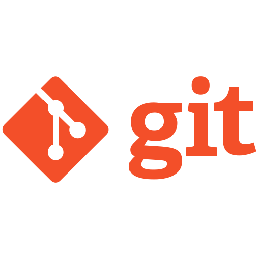
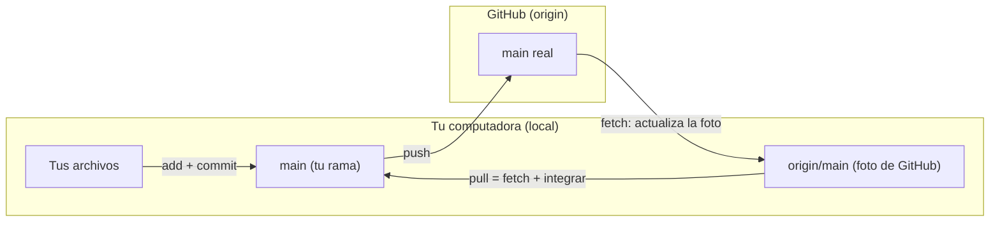
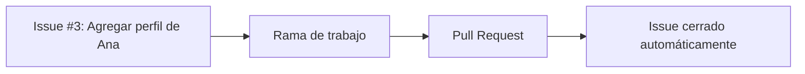
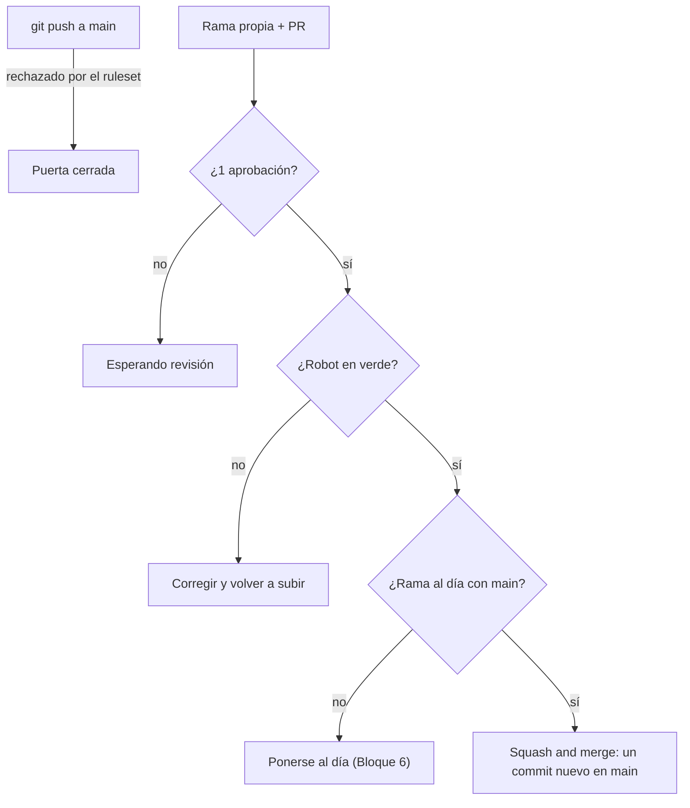
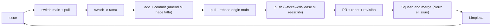

<div align="center">

# Guía del alumno: Git en equipo desde la terminal

Sesión 2 del curso de Git · 4 horas

<br>


&nbsp;&nbsp;&nbsp;&nbsp;


</div>

---

Esta guía te acompaña durante toda la sesión: dice qué se hace en cada bloque, cómo se hace cada actividad y qué debes tener listo antes de pasar al siguiente. Si todavía no instalas lo necesario, empieza por los [requisitos del README](../README.md#antes-de-la-clase).

**Cómo nos repartimos las herramientas:**

| Herramienta | Para qué la usamos |
|---|---|
| **Terminal** (`git` y `gh`) | Todo lo que pasa en tu compu y en tu historial: crear repos, ramas, commits, sincronizar |
| **GitHub.com** | Configurar y revisar: colaboradores, reglas, issues, revisión de Pull Requests, el robot |
| **VS Code** (Graph y GitLens) | Mirar lo que pasó: la vista Graph del panel Source Control y quién escribió cada línea |

**Los bloques de la sesión:**

| # | Bloque | Modalidad |
|---|---|---|
| 1 | El botón era un comando | Individual |
| 2 | Local y origin: el líder publica, el equipo clona | Equipos |
| 3 | Tu primer issue | Individual, en el repo del equipo |
| 4 | El ritual diario y tu primer Pull Request | Individual, en el repo del equipo |
| ☕ | Descanso (10 min) | |
| 5 | Las reglas de la casa | Líder en GitHub.com, el equipo observa |
| 6 | Historia limpia: amend, pull --rebase y squash | Individual, en el repo del equipo |
| 7 | Conflictos en equipo | Individual, en el repo del equipo |
| 8 | Ciclo completo sin red | Equipos |
| | Cierre: no hay una sola forma correcta | Todo el grupo |

---

## <font color="#179287">Cómo usar esta guía</font>

La sesión avanza en **8 bloques** y cada uno abre una pregunta que el siguiente responde. Al final de cada bloque hay una lista **✅ Para seguir adelante**: si puedes marcar todo, estás listo para el siguiente bloque. Si algo no te sale, levanta la mano antes de continuar: casi todo lo que sigue depende de lo anterior.

Durante toda la clase, después de cada comando importante, hazte la misma pregunta: **¿dónde está esto: en mi compu, en origin o en los dos?** Para responderla mira dos lugares: la vista **Graph** de VS Code (tu compu) y **GitHub.com** (origin).

---

### <font color="#F05032">Bloque 1 — El botón era un comando *(individual)*</font>

**Qué es:** cada botón de GitHub Desktop que usaste en la primera sesión en realidad ejecutaba un comando de Git. En este bloque le quitamos el disfraz: vas a crear desde cero, con la terminal, un repositorio local con commits y una rama. Este repo será tu **cuaderno de práctica**: se queda en tu compu y nunca se sube.

**Paso 1 — Abre tu carpeta de práctica**
1. Con el Explorador de archivos (o Finder), crea en el Escritorio una carpeta vacía llamada `practica-terminal`
2. Ábrela en VS Code: `File` → `Open Folder`
3. Abre la terminal integrada con `` Ctrl+` ``: ya está parada dentro de tu carpeta
4. Escribe estos comandos uno por uno y lee lo que responde cada uno:

```bash
git --version        # qué versión de Git tienes
gh auth status       # si GitHub CLI tiene tu sesión iniciada
git config user.name # tu nombre: lo dejó configurado GitHub Desktop
```

**Paso 2 — Crea el repositorio**
1. Escribe `git init`
2. Activa los archivos ocultos (como en la primera sesión): apareció una carpeta `.git`. Eso es exactamente lo que hacía `File → New Repository` en Desktop

> Si la terminal menciona que tu rama se llama `master` en lugar de `main`, no pasa nada. En los siguientes pasos, donde diga `main`, usa `master` en este repo.

---

### 📝 Actividad 1 — El ciclo del commit, en texto

> En VS Code crea el archivo `notas.md` dentro de `practica-terminal` y escribe:

```markdown
# Mis notas de la sesión 2

## Qué espero aprender hoy
- 
- 
```

Ahora haz tu primer commit desde la terminal. Lee en voz baja lo que responde cada comando:

| Comando | Qué ves | Qué botón de Desktop era |
|---|---|---|
| `git status` | `notas.md` en rojo, como *untracked* | El panel **Changes** |
| `git add notas.md` y otra vez `git status` | `notas.md` en verde | Marcar la casilla del archivo |
| `git commit -m "Agrego mis notas"` | El commit se guardó | **Summary** + **Commit to main** |
| `git log --oneline` | Tu commit con su código (*hash*) | La pestaña **History** |

**Ejercicio:** agrega una línea más a `notas.md`, escribe `git diff` para ver en verde y rojo qué cambió, y haz un **segundo commit** repitiendo `add` y `commit`.

---

**Paso 3 — Repasa las ramas, sin botones**
1. `git switch -c prueba` — crea la rama `prueba` y te cambia a ella
2. Haz un cambio en `notas.md` y un commit
3. `git switch main` — el cambio **desaparece** del archivo
4. `git switch prueba` — el cambio **reaparece**
5. Abre la vista **Graph** del panel **Source Control** de VS Code: ahí está la bifurcación

**Tabla de traducción** (tenla a la mano el resto de la clase):

| En GitHub Desktop | En la terminal |
|---|---|
| File → New Repository | `git init` |
| Clone repository | `gh repo clone usuario/repo` |
| Panel Changes | `git status` y `git diff` |
| Marcar la casilla del archivo | `git add archivo` |
| Summary + Commit to... | `git commit -m "mensaje"` |
| Pestaña History | `git log --oneline --graph` |
| Current Branch → New Branch | `git switch -c nombre-de-rama` |
| Cambiar de rama en Current Branch | `git switch nombre-de-rama` |
| Branch → Merge into Current Branch | `git merge nombre-de-rama` |
| Publish repository | `git remote add origin ...` + `git push -u origin main` |
| Push origin | `git push` |
| Fetch origin | `git fetch` |
| Pull origin | `git pull` |
| Create Pull Request | `gh pr create` |

**✅ Para seguir adelante**
- [ ] Tengo la carpeta `practica-terminal` con un repo creado con `git init`
- [ ] `git log --oneline` me muestra al menos 2 commits
- [ ] Vi la rama `prueba` bifurcarse en la vista Graph de VS Code

---

### <font color="#F05032">Bloque 2 — Local y origin: el líder publica, el equipo clona *(equipos)*</font>

**Qué es:** para trabajar en equipo el repo tiene que vivir también en GitHub. En cuanto eso pasa existen **dos copias**: la tuya (**local**) y la de GitHub (**origin**). En este bloque el líder convierte su repo de práctica en el repo del equipo, el resto lo clona, y todos aprenden a saber cuál copia está más actualizada.

> Al terminar, cada integrante tendrá dos repos en su compu: `practica-terminal` (sin origin, solo tuyo) y el repo del equipo (con origin, compartido).

---

#### 👑 Solo el líder del equipo (el resto observa su pantalla)

**Paso 1 — Prepara la base del equipo en tu repo de práctica**
1. En tu `practica-terminal`, crea (o reemplaza) el archivo `README.md` con la base del equipo (ver actividad abajo)
2. Copia del [material de la clase](plantillas-y-robot/) las **dos plantillas**, con la misma ruta y nombre:
   - `.github/ISSUE_TEMPLATE/tarea.md`
   - `.github/pull_request_template.md`

   Para copiarlas: abre cada archivo en GitHub, presiona **Copy raw file**, crea el archivo en VS Code con esa ruta y pega el contenido
3. Revisa con `git status` qué vas a subir, y luego:

```bash
git add .
git commit -m "docs: base del equipo"
```

> `git add .` agrega **todo** lo que cambió en la carpeta. Por eso siempre conviene mirar `git status` antes.

---

### 📝 Actividad 2 — La base del equipo *(líder)*

> Contenido del `README.md` del equipo. La tabla lleva **solo el encabezado**: cada quien agregará su fila más adelante.

```markdown
# Equipo [nombre]

## Integrantes

| Nombre | Carrera | Usuario de GitHub |
|---|---|---|

## Formato del perfil

Cada integrante crea su archivo en `integrantes/[tu-nombre].md` con:

- **Nombre:**
- **Carrera:**
- **Una frase:**
- **Foto:** ``
```

---

**Paso 2 — Crea el repo en GitHub, vacío**
1. En GitHub.com: **New repository** → nombre `equipo-[nombre]` → **Public**
2. **No** marques README, **ni** .gitignore, **ni** licencia. El repo tiene que nacer vacío porque la historia ya existe en tu compu
3. Clic en **Create repository**. GitHub muestra una página de instrucciones: usa el bloque **"…or push an existing repository from the command line"** y copia sus tres comandos a tu terminal:

| Comando | Qué hace |
|---|---|
| `git remote add origin https://github.com/tu-usuario/equipo-[nombre].git` | Le da a tu repo la dirección de su casa en internet, con el apodo `origin` |
| `git branch -M main` | Le pone a tu rama principal el nombre que GitHub espera |
| `git push -u origin main` | Sube `main` y deja amarrada tu rama con la de origin |

4. Refresca GitHub.com: aparecen el README **y** los commits del Bloque 1. Subió la historia completa, pero **no** subió la rama `prueba`: solo sube lo que tú le dices

> ¿Marcaste "Add a README" por error y ahora no puedes hacer push? Lo más rápido es borrar ese repo en **Settings → Danger Zone** y crearlo de nuevo, vacío.

> El repo debe ser **público**: la protección de ramas que usaremos en el Bloque 5 es gratuita en repos públicos de cuentas personales.

**Paso 3 — Agrega a tus compañeros**
1. En tu repo en GitHub: **Settings** → **Collaborators** → **Add people**
2. Agrega el usuario de GitHub de cada compañero

---

#### 👥 El resto del equipo

**Paso 4 — Acepta la invitación y clona el repo**
1. Acepta la invitación desde el correo o desde [github.com/notifications](https://github.com/notifications)
2. En la terminal, sal de tu carpeta de práctica hacia el Escritorio y clona el repo del líder:

```bash
cd ..
gh repo clone usuario-del-lider/equipo-[nombre]
```

3. Abre la carpeta nueva en VS Code: `File` → `Open Folder`

> Clonar es el único momento en el que **no** haces `git init`: el repo ya existe, solo te lo traes.

---

#### 🤝 Todo el equipo

**Paso 5 — Dos repos, dos realidades**
1. En el repo del equipo escribe `git remote -v`: muestra la dirección de origin
2. Si no eres líder, vuelve un momento a tu `practica-terminal` y escribe lo mismo: **no responde nada**. Ese repo no tiene casa en internet, y está bien
3. De regreso en el repo del equipo, escribe `git branch -a`. Verás `main` y `remotes/origin/main`:

| Nombre | Qué es |
|---|---|
| `main` | **Tu** rama, en tu compu |
| `origin/main` | La **foto** que tu compu tiene de la rama `main` que vive en GitHub |

4. En la vista Graph de VS Code, busca las dos etiquetas sobre el mismo commit



**Paso 6 — La foto vieja**
1. **Líder:** agrega una línea de bienvenida al `README.md` y súbela:

```bash
git add README.md
git commit -m "docs: bienvenida al equipo"
git push
```

2. **Resto del equipo:** escriban `git status`. Dice *"Your branch is up to date with 'origin/main'"*. ¿Es verdad? **No**: tu foto de origin es vieja
3. Escriban `git fetch` y otra vez `git status`: ahora dice *"Your branch is behind 'origin/main' by 1 commit"*. En la Graph, `origin/main` está un commit adelante de `main`
4. Escriban `git pull`: la bienvenida aparece en su README y las dos etiquetas vuelven a juntarse

> `git status` no le pregunta a GitHub, le pregunta a **tu foto** de GitHub. `fetch` actualiza la foto; `pull` actualiza la foto y además trae los cambios a tu carpeta.

**✅ Para seguir adelante**
- [ ] El repo `equipo-[nombre]` existe en GitHub, es público y tiene el README base y las dos plantillas
- [ ] Todos los integrantes son colaboradores y tienen el repo clonado
- [ ] Sé explicar la diferencia entre `main` y `origin/main`
- [ ] Todos ven la línea de bienvenida en su README después del `git pull`

---

### <font color="#F05032">Bloque 3 — Tu primer issue *(individual, en el repo del equipo)*</font>

**Qué es:** un **issue** es la unidad de trabajo del equipo, como una **comanda** en una cocina: nadie cocina un platillo sin comanda, y nadie trabaja algo que no tenga issue. Tiene título, descripción, responsable y un número (`#1`, `#2`...) con el que se le puede nombrar en cualquier lugar del repo. En este bloque cada quien crea el issue de la tarea que hará en el Bloque 4: su perfil.

**Paso 1 — Crea tu issue en GitHub.com**
1. En el repo del equipo, pestaña **Issues** → **New issue**
2. Elige la plantilla **Tarea** (la que copió el líder)
3. Título: `Agregar perfil de [tu nombre]`
4. Responde en una línea las dos preguntas de la plantilla:
   - *¿Qué hay que hacer?* → por ejemplo, "Crear mi archivo en `integrantes/` con el formato del README"
   - *¿Cuándo está terminado?* → por ejemplo, "Cuando mi perfil esté en `main`"
5. En el panel derecho: **Assignees** → **assign yourself**
6. Clic en **Create**

**Paso 2 — Mira la misma lista desde la terminal**

```bash
gh issue list
```

La web y la terminal le preguntan lo mismo a GitHub. **Anota el número de tu issue**: lo necesitas en el siguiente bloque.

> Si prefieres la terminal, `gh issue create` hace lo mismo que el formulario. En adelante crea tus issues donde te resulte más cómodo.

**Para observar:** el menú que te ofreció la plantilla "Tarea" existe porque hay un archivo en `.github/ISSUE_TEMPLATE/`. Abre `tarea.md` en VS Code y mira las líneas de arriba, entre los `---`: `name` es el nombre que viste en el menú y `about` su descripción. **La configuración de GitHub es un archivo** que viaja con el repo. Puedes experimentar con esto en la tarea.



**✅ Para seguir adelante**
- [ ] Tengo un issue creado con la plantilla **Tarea** y asignado a mí
- [ ] Anoté el número de mi issue

---

### <font color="#F05032">Bloque 4 — El ritual diario y tu primer Pull Request *(individual, en el repo del equipo)*</font>

**Qué es:** el ciclo que vas a repetir **cada vez** que te sientes a trabajar en un equipo, de la tarea hasta que tu cambio queda en `main`. Tiene tres momentos:

| Momento | Qué significa |
|---|---|
| **Antes** | Ponerte al día |
| **Durante** | Commits pequeños y mirar seguido dónde estás |
| **Después** | Subir, pedir revisión, integrar y limpiar |

En este bloque cada quien trabaja en **su propio archivo**, así que nadie choca con nadie: es el flujo feliz.

**Paso 1 — Antes de empezar**

```bash
git switch main                              # me paro en la base
git pull                                     # me pongo al día con origin
git switch -c feature/[número]-perfil-[tu-nombre]   # abro mi rama desde un main fresco
```

Ejemplo de nombre de rama: `feature/3-perfil-ana`. El número del issue en el nombre ata tu trabajo con su tarea. Mira la barra inferior de VS Code y la Graph: tu rama nace exactamente sobre `main`.

> **Nunca se trabaja en `main`.** Main es la mesa donde se sirve, no la tabla donde se corta.

---

### 📝 Actividad 3 — Tu perfil

> En VS Code crea la carpeta `integrantes` y dentro tu archivo `[tu-nombre].md` siguiendo el formato del README:

```markdown
# Ana López

- **Nombre:** Ana López
- **Carrera:** Ingeniería de Software
- **Una frase:** "Primero que funcione, después que sea bonito."
- **Foto:**


```

---

**Paso 2 — Durante: commits pequeños**
1. Guarda tu primer avance:

```bash
git status
git add integrantes/[tu-nombre].md
git commit -m "docs: agrego perfil de [tu nombre]"
```

2. Haz un segundo cambio pequeño al mismo archivo, míralo con `git diff` antes del `add`, y haz un segundo commit
3. Escribe `git log --oneline --graph`: tus dos commits están encima de `main`

**Convención de mensajes** (así el historial se lee solo):

| Prefijo | Se usa para |
|---|---|
| `docs:` | Documentos |
| `fix:` | Correcciones |
| `feat:` | Algo nuevo |

> En tu rama, commits pequeños y seguidos: son tus puntos de guardado. El panel Source Control de VS Code muestra lo mismo que `git status`, pero hoy lo usamos solo para **mirar**, no para hacer commit.

**Paso 3 — Después: sube tu rama y abre el Pull Request**
1. Sube tu rama. El `-u` le presenta tu rama a origin; a partir de aquí basta con `git push`:

```bash
git push -u origin feature/[número]-perfil-[tu-nombre]
```

2. Abre el PR:

```bash
gh pr create --web
```

3. Se abre el formulario en el navegador, con tu rama elegida y la **plantilla de PR** en la descripción. Llénalo:
   - **Título:** con la misma convención de los commits, por ejemplo `docs: agrego perfil de Ana`. Ese título terminará escrito en la historia de `main`
   - **¿Qué cambia?:** una línea
   - **`Closes #`:** el número de tu issue, por ejemplo `Closes #3`. Es una instrucción para GitHub: cuando este PR se integre, el issue se cierra solo
4. Clic en **Create pull request**

> Cuando ya sabes qué poner, todo cabe en un comando sin abrir el navegador:
> `gh pr create --base main --title "docs: agrego perfil de Ana" --body "Closes #3"`

**Paso 4 — Revisa el PR de un compañero**

Cada quien revisa el PR del compañero **de su derecha**, en GitHub.com:
1. Abre su PR → pestaña **Files changed**: el mismo verde y rojo de siempre
2. Deja un comentario en una línea con el **`+` azul** que aparece al pasar el mouse
3. **Review changes** → **Approve** → **Submit review**

**Paso 5 — Después: integra y limpia**
1. Cuando tu PR tenga aprobación, presiona **Merge pull request** → **Confirm merge** → **Delete branch**
2. Ve a la pestaña **Issues**: tu issue se cerró solo
3. De vuelta en la terminal:

```bash
git switch main
git pull                                             # llegan tu perfil y los de tus compañeros
git branch -d feature/[número]-perfil-[tu-nombre]    # borra tu rama local, ya no sirve
git fetch --prune                                    # borra la foto de la rama que ya no existe en GitHub
git log --oneline --graph
```

4. Lee el log: tus commits de trabajo mezclados con líneas *"Merge pull request #..."*, y la Graph dibuja un nudo por cada PR. **Tómale foto mental a esto**: en el Bloque 6 lo vas a comparar

> Una rama es un desvío temporal. Si una rama vive más de un par de días, algo está mal.

**Paso 6 — GitLens: "¿quién escribió esto?"**

Abre el `README.md` y pon el cursor en una línea que haya escrito el líder:

| Qué ves | Dónde |
|---|---|
| **Current Line Blame** | En gris al final de la línea: autor, hace cuánto y mensaje del commit |
| **Hover** | Al pasar el mouse sobre ese texto gris: tarjeta con autor, fecha, mensaje completo y qué cambió |
| **CodeLens** | Arriba del archivo: último cambio y lista de autores |

> GitLens solo **mira**: no sube ni cambia nada, y no necesita cuenta. Si te ofrece botones como *Explain*, *Connect to GitHub*, *Revert*, *Reset* o *Rebase*, **no los uses hoy**: unos piden cuenta y los otros los hacemos con comandos.

**✅ Para seguir adelante**
- [ ] Mi perfil está en `main` en GitHub y mi issue aparece cerrado
- [ ] Revisé y aprobé el PR de un compañero
- [ ] Borré mi rama local y `git branch` solo muestra `main`
- [ ] Vi los "Merge pull request" y los nudos en `git log --oneline --graph`

---

### ☕ Descanso — 10 minutos

---

### <font color="#F05032">Bloque 5 — Las reglas de la casa *(líder en GitHub.com, el equipo observa)*</font>

**Qué es:** hasta ahora todos siguieron el ritual porque se les pidió. En este bloque el líder configura el repo para que el ritual sea **obligatorio**: nadie podrá subir directo a `main`, todo entrará por PR con una aprobación, la historia de `main` será una línea recta y un **robot** revisará cada PR.

---

#### 👑 Solo el líder (el resto del equipo mira su pantalla)

**Paso 1 — La puerta abierta**

Demuestra el problema: edita el `README.md` estando en `main` y súbelo directo:

```bash
git switch main
git commit -am "docs: cambio directo"
git push
```

Funciona. Nadie lo revisó y nadie sabe por qué se hizo: así se rompen los proyectos.

**Paso 2 — Decide cómo entra el trabajo a main**

En GitHub.com: **Settings** → **General** → sección *Pull Requests*:
1. **Desmarca** *Allow merge commits* y *Allow rebase merging*. Deja marcado solo **Allow squash merging**
2. En su lista *Default commit message*, elige **Pull request title and description**
3. Activa **Automatically delete head branches** (al integrar un PR, GitHub borra la rama remota solo)

> **Squash** significa *aplastar*: a partir de ahora, todos los commits de una rama entran a `main` como **un solo commit**, con el título del PR y un `(#número)` que lleva directo al PR. Lo practicarás en el Bloque 6.

**Paso 3 — Protege main con un ruleset**

**Settings** → **Rules** → **Rulesets** → **New ruleset** → **New branch ruleset**:

| Campo | Qué poner | En lenguaje de equipo |
|---|---|---|
| Ruleset name | `proteger-main` | |
| Enforcement status | **Active** | |
| Target branches | **Add target** → *Include default branch* | Las reglas aplican a `main` |
| Restrict deletions | Dejar marcada | Nadie borra `main` |
| Block force pushes | Dejar marcada | Nadie reescribe `main` |
| Require linear history | **Marcar** | `main` es una línea recta, sin nudos |
| Require a pull request before merging | **Marcar** → *Required approvals*: **1** | Todo entra por PR con al menos un visto bueno |

Clic en **Create**.

**Paso 4 — Ni el dueño**
1. Repite el truco del Paso 1: otro commit directo en `main` y `git push`
2. Ahora la terminal lo **rechaza** (*"Repository rule violations"*, *"Changes must be made through a pull request"*). Eres el administrador del repo y aun así no pudiste: la regla no es para desconfiar de alguien, es para que nadie tenga que acordarse
3. Tu `main` local quedó con un commit que origin nunca va a aceptar. Déjalo igual a origin:

```bash
git reset --hard origin/main
```

> ⚠️ `git reset --hard origin/main` **tira** los cambios locales que no estén en origin. Úsalo solo cuando estés seguro de que no los quieres.

**Paso 5 — Contrata al robot**
1. En GitHub.com, pestaña **Actions** → **set up a workflow yourself**
2. Nombra el archivo `revision.yml`, borra el contenido de ejemplo y pega la receta del [material](plantillas-y-robot/.github/workflows/revision.yml) (con **Copy raw file**)
3. Clic en **Commit changes**. Como ya no se puede escribir directo en `main`, elige **Create a new branch for this commit and start a pull request**
4. En ese PR aparece el check **Sin marcadores de conflicto** corriendo y luego en verde
5. Un compañero lo aprueba y el líder lo integra: el botón ahora dice **Squash and merge**, la única opción que dejaron. Hasta el robot tuvo que entrar por PR

> **¿Qué es el robot?** Una receta: cada vez que alguien abre un PR, GitHub presta una computadora por unos segundos, sigue la receta y reporta el resultado en el PR. Esta receta revisa que nadie deje marcadores de conflicto (`<<<<<<<` o `>>>>>>>`) olvidados. Desde la terminal puedes ver sus ejecuciones con `gh run list`.

**Paso 6 — Haz obligatorio al robot**

Vuelve al ruleset `proteger-main`:
1. Marca **Require status checks to pass** → **Add checks** → busca y agrega **Sin marcadores de conflicto**
2. Marca **Require branches to be up to date before merging**
3. **Save changes**

Traducción: "el robot tiene que dar el visto bueno" y "tu rama tiene que estar al día con `main`".

---

#### 🤝 Todo el equipo

**Paso 7 — Tráete la receta y observa la demo**
1. En tu terminal: `git switch main` y `git pull`
2. Observa la demostración del instructor: un PR con un marcador `<<<<<<<` olvidado muestra la **X roja** del robot y el merge bloqueado; al corregirlo, la X se vuelve palomita verde. En la terminal eso se consulta con `gh pr checks`



**✅ Para seguir adelante**
- [ ] El repo solo permite **Squash and merge** y borra las ramas al integrar
- [ ] El ruleset `proteger-main` está activo y un push directo a `main` es rechazado
- [ ] El robot corrió al menos una vez y es un check obligatorio
- [ ] Todos hicieron `git pull` en `main` y tienen `.github/workflows/revision.yml`

---

### <font color="#F05032">Bloque 6 — Historia limpia: amend, pull --rebase y squash *(individual, en el repo del equipo)*</font>

**Qué es:** la última regla dice que tu rama tiene que estar al día con `main`, pero mientras trabajas tus compañeros siguen integrando cosas: tu rama nace fresca y envejece sola. En este bloque aprendes a mantener la historia limpia sin perder la pista de nada. La meta: **un PR = un commit en `main`**. Para lograrlo se combinan cuatro herramientas, cada una en su momento:

| Herramienta | Cuándo |
|---|---|
| Commits pequeños | Mientras trabajas en tu rama |
| `git commit --amend` | Para corregir tu último commit **antes** de subirlo |
| `git pull --rebase origin main` | Para poner tu rama al día sin nudos |
| **Squash and merge** | Para integrar tu PR a `main` |

En este bloque **no hay conflictos**: cada quien sigue tocando solo su archivo.

**Paso 1 — Nueva tarea, con todo el ritual**
1. Crea un issue `Agregar mi ritual de trabajo a mi perfil` (en la web o con `gh issue create`) y asígnatelo
2. `git switch main` y `git pull`. Fíjate en lo que responde: **Fast-forward**. Como nadie trabaja directo en `main`, `main` solo avanza hacia adelante
3. `git switch -c feature/[número]-ritual-[tu-nombre]`

---

### 📝 Actividad 4 — Mi ritual de trabajo

> Agrega esta sección al final de **tu** perfil (`integrantes/[tu-nombre].md`), con los tres momentos escritos en tus palabras, y haz commit:

```markdown
## Mi ritual de trabajo

1. **Antes:** 
2. **Durante:** 
3. **Después:** 
```

---

**Paso 2 — El commit con un olvido: `amend`**
1. Encuentra algo que te faltó (un error de dedo, una línea más). La tentación es hacer otro commit llamado *"ya ahora sí"*. En su lugar:

```bash
git add integrantes/[tu-nombre].md
git commit --amend --no-edit     # mete este cambio al último commit, sin tocar su mensaje
git log --oneline                # sigue habiendo UN commit, pero su hash cambió
```

2. Si lo que estaba mal era el mensaje: `git commit --amend -m "docs: agrego mi ritual de trabajo"`
3. Ahora sí, sube tu rama y abre el PR:

```bash
git push -u origin feature/[número]-ritual-[tu-nombre]
gh pr create --base main --title "docs: agrego mi ritual de trabajo" --body "Closes #[número]"
```

> Amend es gratis mientras el commit no haya salido de tu compu. Antes de hacer push, corrige todo lo que quieras.

**Paso 3 — Tu rama envejeció**

En cuanto el primer PR del equipo se integra, los demás ven en su PR el aviso **"This branch is out-of-date with the base branch"** y el merge bloqueado. GitHub ofrece un botón **Update branch**: **no lo uses**, porque mete un commit de merge dentro de tu rama, justo el nudo que queremos evitar.

**Merge vs. rebase, con post-its:** tu rama es un post-it pegado sobre una versión vieja del documento.
- **merge:** pegas encima otro post-it que dice "aquí junté lo nuevo". Funciona, pero la historia se llena de nudos
- **rebase:** despegas tu post-it, cambias la hoja de abajo por la versión más nueva y vuelves a pegar tu post-it encima. La historia queda en línea recta, como si hubieras empezado a trabajar hoy

**Paso 4 — Ponte al día con rebase**

Parado en tu rama:

```bash
git pull --rebase origin main    # trae lo nuevo de main y vuelve a pegar tus commits encima
git push                         # RECHAZADO: ¿por qué?
git push --force-with-lease      # empuja a la fuerza, pero solo si nadie más tocó tu rama
```

- Mira la Graph: tu commit ahora está encima del último commit de `main`, en línea recta
- El `git push` normal fue rechazado porque el rebase creó commits **nuevos** (con otro hash) y origin todavía tiene los viejos. Pasa lo mismo si haces `amend` de un commit que ya habías subido
- `--force-with-lease` es la versión con cinturón de seguridad del `--force` a secas
- En tu PR, el aviso de rama vieja desaparece, el robot vuelve a correr y el merge se desbloquea

**Paso 5 — Squash and merge: un PR, un commit**
1. Cuando tu PR tenga aprobación, presiona **Squash and merge**
2. **Antes de confirmar, lee la caja que aparece:** el título es el de tu PR con un `(#número)` al final, y la descripción trae tu `Closes #`. Eso es lo que quedará escrito en `main` para siempre: por eso el título del PR importa
3. Confirma. En la terminal:

```bash
git switch main
git pull
git log --oneline --graph
```

4. **Compara con tu foto mental del Bloque 4:** arriba, una línea recta con un commit por PR y su `(#número)`; abajo, los nudos y los *"Merge pull request..."* de antes de las reglas

**Paso 6 — La pista no se perdió**
1. Abre tu perfil y pasa el mouse sobre la sección nueva: el hover de **GitLens** muestra el commit del squash con su `(#número)`
2. En esa tarjeta, **Open Commit on GitHub** (solo abre el navegador) te lleva al commit, y ahí GitHub enlaza el PR. Desde la terminal: `gh pr view [número] --web`
3. En el PR siguen vivos tus commits pequeños, los comentarios de la revisión y el issue que lo originó

> **Main cuenta el qué. El PR cuenta el cómo. El issue cuenta el porqué.**

**Paso 7 — Limpieza después de un squash**
1. `git branch -d feature/...` ahora **falla** con *"not fully merged"*. No es un error: tus commits se aplastaron en uno nuevo con otro hash, y Git no los reconoce dentro de `main`
2. Confirma que el PR dice **Merged** (en la web o con `gh pr view feature/...`)
3. Bórrala con `git branch -D feature/...` (la `-D` mayúscula significa "ya verifiqué, bórrala de todas formas")

**Paso 8 — Vuélvelo costumbre**

Ahora que sabes qué significa, configura Git para que cada `git pull` haga rebase en vez de merge:

```bash
git config --global pull.rebase true
```

**Reglas de oro:**
- Solo se reescribe historia **propia**: `amend`, `rebase` y `--force-with-lease` únicamente en tu rama y mientras nadie más trabaje en ella. La historia de `main` **nunca** se reescribe
- Nunca `--force` a secas; siempre `--force-with-lease`
- Una rama, un PR. Después del squash la rama muere; lo siguiente nace de un `main` fresco
- Si algo sale raro a media operación: `git rebase --abort` y todo vuelve a como estaba

**Mapa de decisiones:**

| Situación | Herramienta | ¿Reescribe historia? |
|---|---|---|
| Quiero guardar un avance en mi rama | Commit pequeño | No |
| Me equivoqué en el último commit y **no** lo he subido | `git commit --amend` | Sí, solo mi último commit, en mi compu |
| `main` avanzó mientras yo trabajaba | `git pull --rebase origin main` | Sí, solo mi rama |
| Subir una rama que reescribí (rebase o amend) | `git push --force-with-lease` | Sí, solo mi rama en origin |
| Integrar mi trabajo a `main` | **Squash and merge** en el PR | No: agrega un solo commit a `main` |
| Traer `main` a mi compu | `git pull` estando en `main` | No: siempre es fast-forward |
| Deshacer algo que ya está en `main` | `git revert` en una rama nueva + PR | No: agrega un commit que lo anula |

**✅ Para seguir adelante**
- [ ] Usé `git commit --amend` al menos una vez antes de subir
- [ ] Puse mi rama al día con `git pull --rebase origin main` y la subí con `--force-with-lease`
- [ ] Mi PR entró a `main` con **Squash and merge** como un solo commit con `(#número)`
- [ ] Borré mi rama con `git branch -D` después de ver el PR en *Merged*
- [ ] Configuré `pull.rebase true`

---

### <font color="#F05032">Bloque 7 — Conflictos en equipo *(individual, en el repo del equipo)*</font>

**Qué es:** un **conflicto** ocurre cuando dos personas cambian la misma línea del mismo archivo y Git no sabe cuál versión es la buena. En este bloque lo provocamos a propósito: todos van a escribir en el mismo lugar del `README.md`. Lo vas a resolver en el editor de VS Code y a terminar el rebase desde la terminal, sin pánico.

**Paso 1 — La tarea que garantiza el choque**
1. Crea un issue `Agregar mi fila a Integrantes` y asígnatelo
2. Ritual de antes: `git switch main`, `git pull`, `git switch -c feature/[número]-fila-[tu-nombre]`
3. Agrega tu fila a la tabla del `README.md` (ver actividad abajo)
4. Commit, `git push -u origin ...` y PR con `Closes #[número]`

---

### 📝 Actividad 5 — Tu fila en la tabla

> En el `README.md` del equipo, agrega **tu fila justo debajo del encabezado** de la tabla *Integrantes*:

```markdown
| Nombre | Carrera | Usuario de GitHub |
|---|---|---|
| Ana López | Ingeniería de Software | @analopez |
```

---

**Paso 2 — Chocan**
1. El primer PR aprobado se integra con **Squash and merge**
2. Los demás ven en su PR un aviso nuevo: **"This branch has conflicts that must be resolved"**
3. En tu rama, ponte al día como en el Bloque 6:

```bash
git pull --rebase origin main
```

4. La terminal responde **CONFLICT** y se detiene a mitad del camino. Escribe `git status`: te dice que estás en medio de un rebase, qué archivo está en conflicto y cómo seguir (`--continue`) o salir (`--abort`)

> Git no se rompió. Se detuvo a preguntarte algo que no puede decidir solo.

**Paso 3 — Resuelve el conflicto en VS Code**
1. En el panel Source Control, abre el `README.md` marcado. Verás las marcas de conflicto y los botones **Accept Current Change / Accept Incoming Change / Accept Both Changes** (o **Resolve in Merge Editor** para verlo en tres paneles):

```
<<<<<<< HEAD
| Luis Pérez | Ciencias de la Computación | @luisperez |
=======
| Ana López | Ingeniería de Software | @analopez |
>>>>>>> docs: agrego mi fila a Integrantes
```

2. ⚠️ **Durante un rebase las etiquetas se sienten al revés:**

| Etiqueta | Qué es durante un rebase |
|---|---|
| **Current** | Lo que **ya está en `main`** (la fila de tu compañero) |
| **Incoming** | **Tu** commit, que se está volviendo a pegar |

3. En este ejercicio queremos las dos filas: elige **Accept Both Changes**
4. Revisa que la tabla quede bien (sin marcas, una fila por persona) y guarda

**Paso 4 — Termina el rebase desde la terminal**

```bash
git add README.md          # le avisas a Git que ya resolviste este archivo
git rebase --continue      # Git abre un editor con el mensaje del commit
git push --force-with-lease
```

- Al hacer `--continue` no hay que cambiar el mensaje, solo cerrar el editor: si se abre como pestaña de VS Code, **cierra la pestaña**; si se abre dentro de la terminal, escribe `:wq` y presiona **Enter**
- En la Graph, tu rama sigue siendo **una línea recta** encima de `main`: el conflicto se resolvió *dentro* de tu commit, sin un commit extra de "arreglo el merge"
- En el PR, el aviso de conflicto desaparece y el robot corre. Si dejaste una marca olvidada, el robot se pone en **rojo**: corrige, commit, push, y vuelve a verde

> **Botón de pánico:** en cualquier momento antes del `--continue`, `git rebase --abort` te regresa a como estabas.

**Paso 5 — Integren en cadena**
1. Integren el resto de los PRs con **Squash and merge**, uno por uno. El tercero y el cuarto probablemente vuelvan a chocar: que cada autor lo resuelva por su cuenta, repitiendo los pasos 2 a 4
2. Al final: `git switch main`, `git pull` y `git branch -D` de tu rama ya integrada
3. Abre el `README.md` y activa la anotación de todo el archivo: `Ctrl+Shift+P` → **GitLens: Toggle File Blame**. Cada fila de la tabla muestra a su autor y el `(#número)` de su PR. Se apaga con el mismo comando

**✅ Para seguir adelante**
- [ ] Resolví un conflicto durante un `pull --rebase` sin borrar la fila de nadie
- [ ] La tabla *Integrantes* tiene una fila por integrante y ninguna marca de conflicto
- [ ] La historia de `main` sigue siendo una línea recta
- [ ] Vi con File Blame quién escribió cada fila

---

### <font color="#F05032">Bloque 8 — Ciclo completo sin red *(equipos)*</font>

**Qué es:** la prueba real. Vas a repetir el ciclo completo **sin instrucciones paso a paso**, usando solo el [acordeón](#acordeón-el-ritual-de-trabajo-en-equipo) de abajo. El instructor y los asistentes solo responden preguntas; no tocan teclados.

**La consigna:** cada quien crea un issue **para otra persona** del equipo, y cada quien resuelve el issue que le asignaron.

---

### 📝 Actividad 6 — Una recomendación

> El issue que crees para tu compañero le pide agregar el archivo `recomendaciones/[su-nombre].md` con algo que recomiende:

```markdown
# Recomendación de [nombre]

**Qué es:** libro / video / canal / curso
**Título:** 
**Enlace:** [abrir](https://...)

## Por qué lo recomiendo

```

---

**Cómo se hace (sin red)**
1. Crea el issue y asígnalo a tu compañero (en la web, o con `gh issue create --assignee usuario-del-compañero`)
2. Encuentra el tuyo: `gh issue list --assignee @me`
3. Ritual de antes, trabajo, ritual de después, revisión, `amend` y `pull --rebase` si hacen falta, **Squash and merge** y limpieza



**Limpieza final, todos:**

```bash
git switch main
git pull
git branch          # solo debe quedar main (si queda alguna rama con PR integrado: git branch -D)
git fetch --prune
git log --oneline
```

**La prueba final:** en `git log --oneline`, cada línea desde el Bloque 5 debe ser **un PR**, con título convencional y `(#número)`. Si encuentras un *"ya ahora sí"* o un *"Merge branch..."* en esa zona, algo del ritual se saltó.

**✅ Para terminar la sesión**
- [ ] Creé un issue para un compañero y resolví el que me asignaron, solo con el acordeón
- [ ] La pestaña **Issues** no tiene nada abierto y la pestaña **Pull requests** tampoco
- [ ] `git branch` solo muestra `main`
- [ ] Desde el Bloque 5, cada línea de `git log --oneline` es un PR con su `(#número)`

---

### <font color="#F05032">Cierre — No hay una sola forma correcta</font>

Todo lo que hicimos hoy (un issue por tarea, una rama por issue, un visto bueno obligatorio, un robot revisor, rebase para ponerse al día, squash para integrar) es **una** estrategia. La elegimos porque sirve para enseñar y funciona bien para un equipo chico que trabaja en paralelo sobre el mismo repo. **No es la definitiva ni la correcta.**

Pregúntate en cada fila: *¿esto cambiaría nuestras reglas?*

| Factor | Lo empuja hacia menos reglas | Lo empuja hacia más reglas |
|---|---|---|
| **Tamaño del equipo** | 1 a 3 personas que se sientan juntas | Decenas de personas que no se conocen |
| **Tamaño y vida del proyecto** | Un prototipo de fin de semana | Un producto que vivirá años |
| **Tiempo disponible** | Un hackatón de 48 horas | Un semestre o un proyecto sin fecha de fin |
| **Burocracia que el equipo acepta** | Confianza total, acuerdos de palabra | Aprobaciones, revisores designados, checklists |
| **Trazabilidad necesaria** | Nadie va a preguntar por qué se hizo algo | Hay que explicar cada cambio |
| **Costo de un error** | Si algo se rompe, se arregla en cinco minutos | Si algo se rompe, afecta a usuarios reales |
| **Frecuencia de entrega** | Se entrega una vez, al final | Se entrega todos los días |
| **Experiencia del equipo** | Todos dominan Git | Hay quien está empezando |

Ahora les toca a ustedes decidir: de eso trata la tarea **"Nuestras reglas del juego"**. 👉 [Instrucciones completas de la tarea](tarea.md)

> Las reglas están para servirle al equipo, no al revés. Tu `practica-terminal` se queda contigo: es tu repo para equivocarte sin consecuencias antes de probar algo en el repo del equipo.

---

## <font color="#179287">Acordeón: el ritual de trabajo en equipo</font>

| Momento | Qué hago | Dónde / comando |
|---|---|---|
| **Antes** | Ver qué me toca | GitHub.com → Issues, o `gh issue list --assignee @me` |
| | Pararme en la base | `git switch main` |
| | Ponerme al día | `git pull` |
| | Abrir mi rama | `git switch -c feature/[número]-[descripción]` |
| **Durante** | Ver qué cambió | `git status` / `git diff` |
| | Guardar un avance pequeño | `git add [archivo]` + `git commit -m "tipo: mensaje"` |
| | Corregir mi último commit (antes de subirlo) | `git add [archivo]` + `git commit --amend --no-edit` |
| | Ver dónde estoy | `git log --oneline --graph` / Graph de VS Code |
| | Si main avanzó, ponerme al día | `git pull --rebase origin main` |
| **Después** | Subir mi rama | `git push -u origin [rama]` (la primera vez) / `git push` |
| | Subir después de un rebase o amend | `git push --force-with-lease` |
| | Pedir revisión | `gh pr create --web` (con plantilla) o `gh pr create --base main --title "tipo: qué hice" --body "Closes #[número]"` |
| | Ver el robot | Checks del PR en GitHub.com, o `gh pr checks` |
| | Revisar a otros | GitHub.com → Files changed → Review changes |
| | Integrar | GitHub.com → **Squash and merge** |
| | Limpiar después del squash | `git switch main` + `git pull` + `git branch -D [rama]` (cuando el PR diga *Merged*) |
| **Pánico** | Salir de un rebase a medias | `git rebase --abort` |
| | Deshacer algo que ya está en main | `git revert [hash]` en una rama nueva + PR |
| | Dejar mi main igual a origin | `git reset --hard origin/main` (borra lo que no esté en origin) |

**Reglas de oro:**

- Nunca se trabaja directo en `main`.
- Solo se reescribe historia **propia** (`amend`, `rebase`, `--force-with-lease`), y de preferencia antes de compartirla. La historia de `main` nunca se reescribe.
- Nunca `--force` a secas; siempre `--force-with-lease`.
- Una rama, un PR. Después de integrar, la rama se borra.

> Estas son las reglas que usamos en clase, no las únicas posibles. Cada equipo puede y debe elegir las suyas: de eso trata la tarea.

---

## <font color="#179287">Si algo sale mal</font>

| Problema | Solución |
|---|---|
| Al hacer commit dice *"Please tell me who you are"* | Configura tu identidad: `git config --global user.name "Tu Nombre"` y `git config --global user.email "tu-correo-de-github"` |
| El líder creó el repo en GitHub **con** README y no puede hacer push | Borrar el repo en **Settings → Danger Zone** y crearlo de nuevo, vacío |
| Me perdí por completo en mi copia del repo del equipo | Borra la carpeta y vuelve a clonar con `gh repo clone`: todo lo que estaba en origin sigue ahí |
| Seguí trabajando en una rama que ya se integró con squash y ahora choca | Crea una rama nueva desde un `main` fresco y lleva ahí solo el cambio nuevo |
| Estoy a mitad de un rebase y no sé qué pasó | `git rebase --abort` y vuelves a como estabas |
